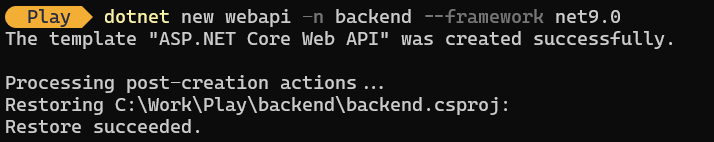
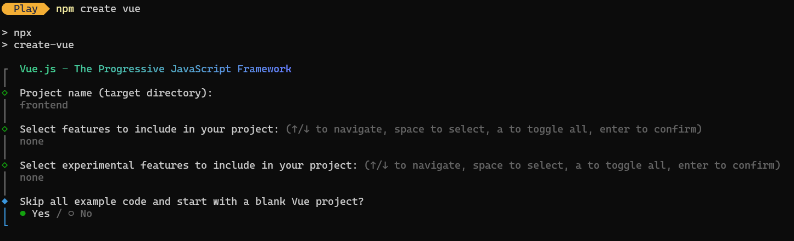

# 🎬 Intro to GitHub Copilot Workshop

Welcome to the **GitHub Copilot** workshop! This hands-on project guides you through building a stylish, production-ready application using the latest tools and best practices.

## 🚀 Project Structure

**Backend:** ASP.NET Core Web API<br>
<span style="color:#6c63ff">• Manage movies / categories</span>

**Frontend:** Vue 3 + Vite<br>
<span style="color:#6c63ff">• Modern UI for browsing and seeding movies</span>

**MCP Server:** Model Context Protocol<br>
<span style="color:#6c63ff">• Advanced agent features & Copilot customizations to help with our code tasks</span>

---

## 🛠️ What You'll Learn

- Scaffold and connect backend & frontend
- Add database context and models
- Write and run backend tests
- Build a beautiful Vue UI
- Connect frontend to backend API
- Define customizations for GitHub Copilot
- Use MCP server for agent customizations

---

## 📚 How to Use This Workshop

Follow the numbered instructions in this folder for a step-by-step, interactive experience. Each step is designed to be clear, visual, and beginner-friendly.

Ready to build something awesome? Let’s get started!

## Project Structure

- `frontend/`: Contains the Vuejs frontend application code. This app allows users to interact with the movie database, view movie details, and perform basic operations via RESTful APIs to backend.
- `backend/`: Contains the .NET core backend application code.

## Prerequisites

Before starting the workshop, ensure you have the following installed on your machine:

- GitHub handle with access to GitHub Copilot
- [.NET SDK 9.0 or later](https://dotnet.microsoft.com/en-us/download/dotnet/9.0)
- [Node.js and npm](https://nodejs.org/en/download/)
- [Git](https://git-scm.com/downloads)
- A code editor [Visual Studio Code](https://code.visualstudio.com/) - you can also use other IDEs like Visual Studio, but instructions are written with VS Code in mind for this workshop.
- [GitHub Copilot extension for Visual Studio Code](https://marketplace.visualstudio.com/items?itemName=GitHub.copilot)

Even though you can use terminal or command prompt to run commands, it is recommended to use GitHub Copilot Chat to run commands and interact with the project as this workshop is focused on using GitHub Copilot in action.

Last tasks are specific to Github as platform and requires a Github repository. If you use Azure DevOps or other platform, you can skip those tasks. We do recommend going through those tasks to get familiar with Github specific features and how GitHub Copilot helps.

Before starting the workshop, clone the repository to your local machine using the following command:

```bash
git clone provided-repository-url
```

or create new projects for `frontend` and `backend` by running on root folder:

Open terminal or command prompt and run the following commands to create the project structure:

**Backend:**

```
dotnet new webapi -n backend --framework net9.0
```

]

**Frontend:**

```
npm create vue
```

Put in the name "frontend" and select default options. Select only `Yes for Skip all example code and start with a blank project`.

]


## Start with the workshop

Go to the first instruction file: [First task](1-clean-boilerplate.md) to start working with our backend.

<a href="1-clean-boilerplate.md">
  
</a>