# 🧹 Clean boilerplate code

Navigate to the backend project directory. It is folder named `Backend`.

Open GitHub Copilot chat: 

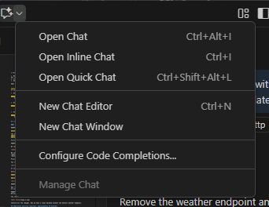

and select GPT 4.1

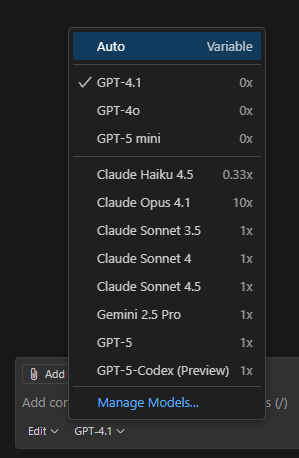

Run backend manually (Open terminal in the backend folder):

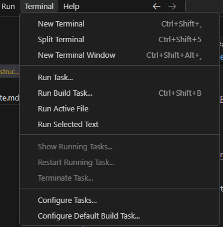

**NOTE:** 
check that you are in the right folder where the .csproj file is located. You can run pwd in the terminal to see the current directory.

1. Restore the necessary packages by running the command (open terminal or command prompt):

    ```
    dotnet restore
    ```

2. Build the project using the command:

   ```
     dotnet build
   ```

3. Run the backend server with the command:

   ```
    dotnet run
    ```

Exit the running server by pressing `Ctrl + C` in the terminal.

Let's do the same but using Copilot chat to run the backend server.

Open copilot chat and run `Start Backend` command. 

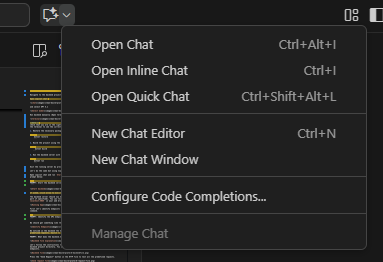

Make sure you have agent mode selected. Select also model `GPT 4.1`.

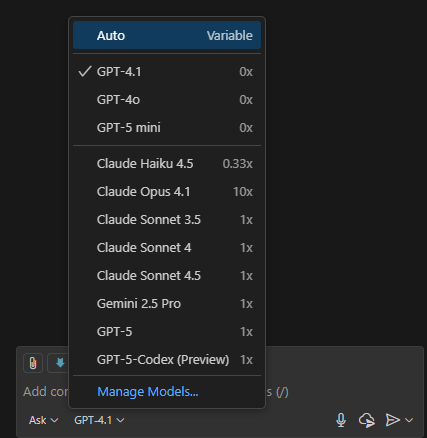

Copy prompt below (without PROMPT: part) and paste it in the chat input area:

 ```
PROMPT: Start the backend server.
 ```

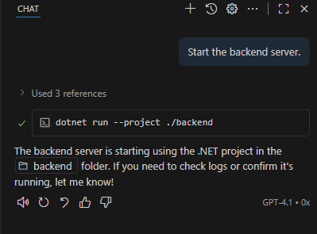

If asked, click allow to execute the command in terminal. 

The backend server should now be running and accessible at `http://localhost:5065` (or another port if specified). You can test the API endpoints if it works by navigating to `http://localhost:5065` in your web browser. But we will use agent to test it for us.

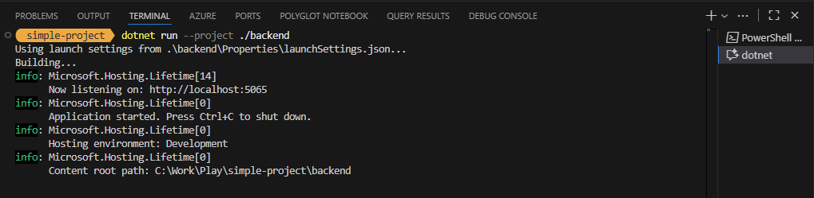

First let's identify endpoints in our backend. Open copilot chat and run `Identify Endpoints` command.

```
PROMPT: Identify the API endpoints in the backend server.
```

We should get something like this:

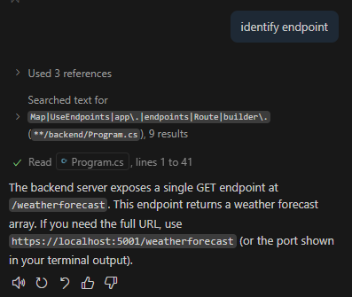

We noticed in the backend the backend.http file. Let's open it to see if there are any predefined requests. Switch to ask mode in copilot chat. 

```
PROMPT: What does the backend.http file contain and how to use it?
```

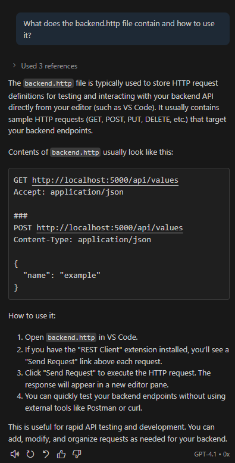

Let's follow the instructions to test the API endpoints. Open the **backend.http** file in the backend project directory. You should see predefined HTTP requests for testing the API endpoints.

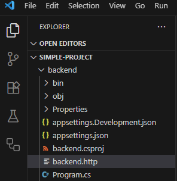

Press the `Send Request` button in the HTTP file to test all the predefined requests.

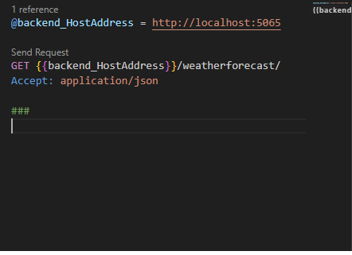

You should see something like this:

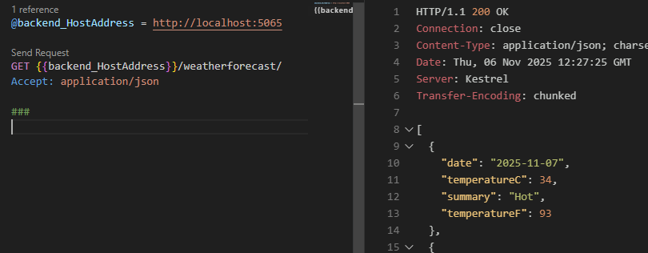

If you open **Program.cs**, you'll see the default weather implementation.

Select `app.MapGet("/weatherforecast", ...)` and go to copilot chat, change agent mode from agent to ask and run:

```
PROMPT: /explain 
```

Now enter #selection and it will change to specific selection with line in code. Then write end of the prompt: 

```
PROMPT: what does this code do?
```

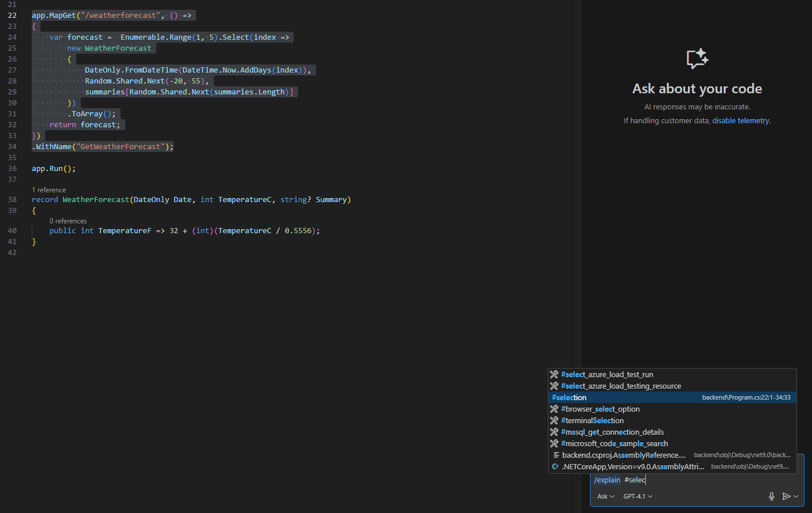

Copilot will explain what the code does and since this is boilerplate code we don't need it.

Remove safely that implementation. Change to `edit mode` (confirm the change) and write (you need to write to use # signal) the prompt:

```
PROMPT: remove boiler plate code with weather endpoint from the #file:Program.cs  and update #file:backend.http file
```

You should see something like this:


Confirm all the changes. Now we have a clean backend without the default weather endpoint.

## Try different model

Do the same again, but with different model (Claude Sonnet 4 for example). You can restore the original boilerplate code by using git or create a new .NET project.

```
git restore .

OR 

git checkout -- .
```
This will revert all modified files back to the last committed state.

Or you can delete the folder of the existing backend and create new .NET project by running on root folder:

```
dotnet new webapi -n backend --framework net9.0
```

Then open the new project in your code editor and follow the same steps to remove boilerplate code using Copilot chat with Claude Sonnet 4 model or any other preferred model.

## Next steps

Now that we have cleaned the boilerplate code, we can proceed to implement our own API endpoints for the movie database project. You can start by defining the data models, setting up the database context, and creating the necessary controllers for handling movie data.

### ➡️ [Next Task: Add Code to Backend](2-add-code-for-backend.md)
