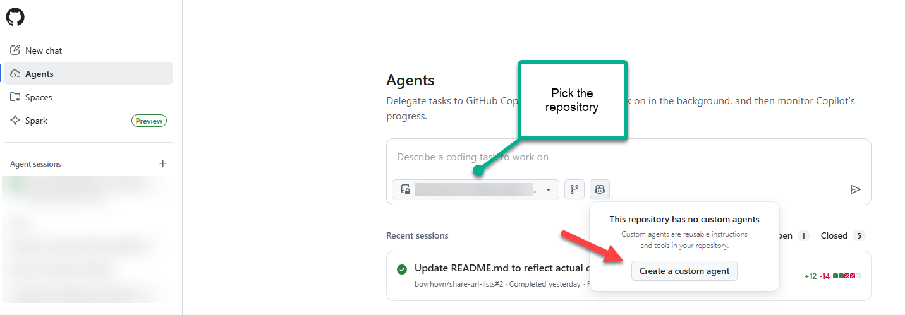
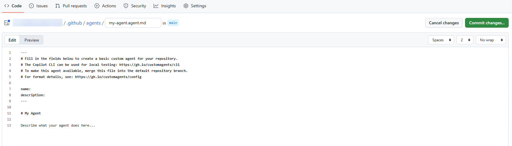
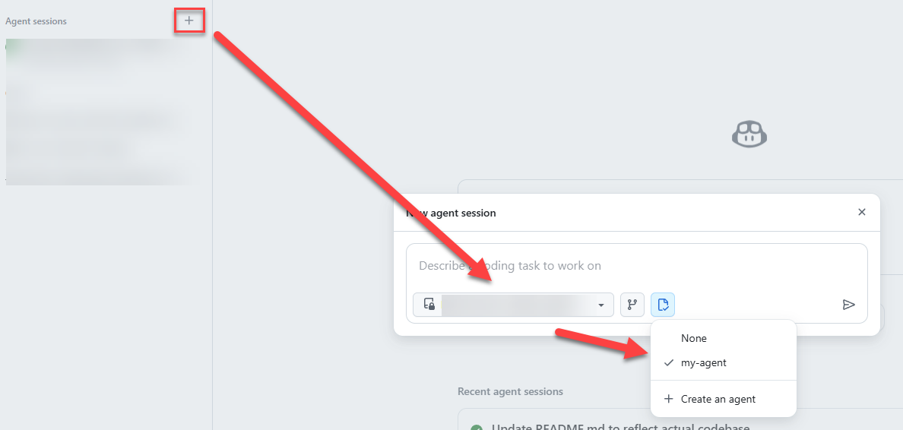
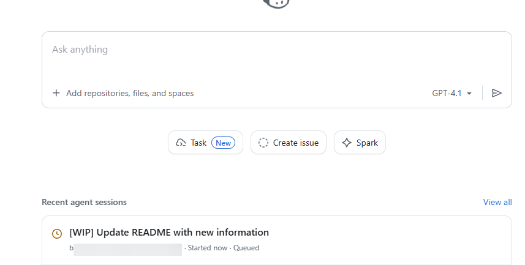
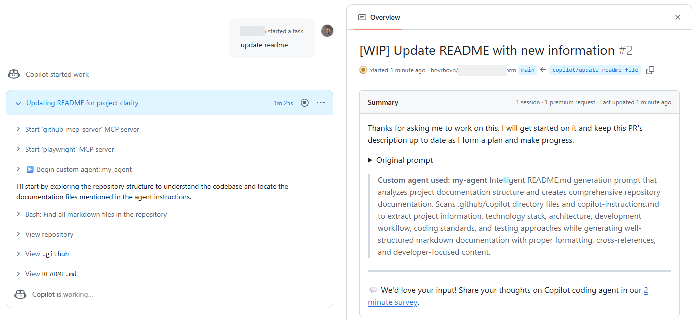
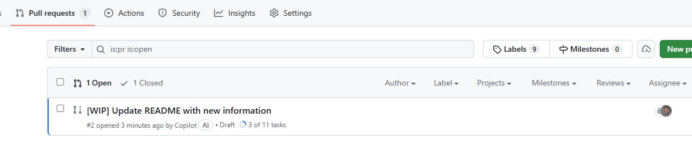
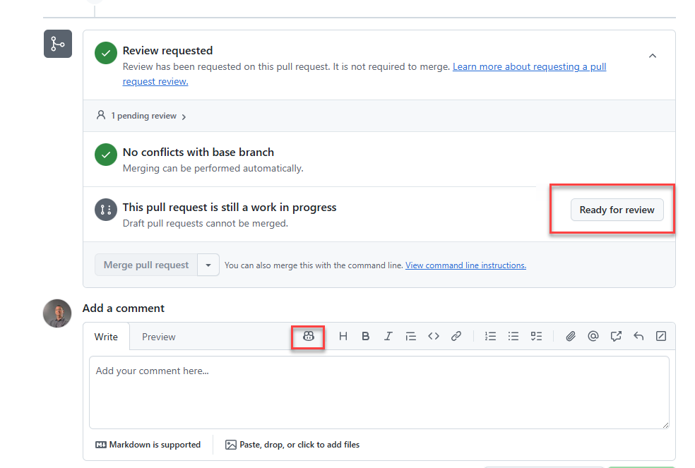
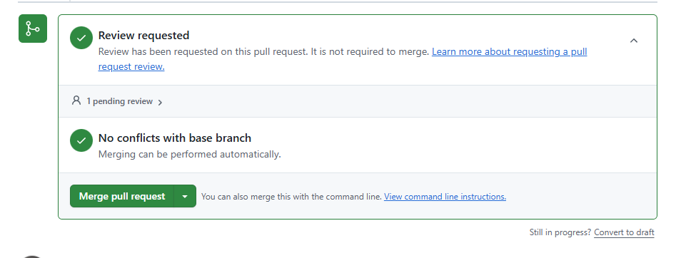
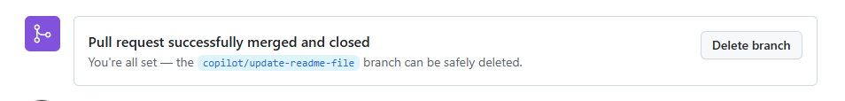

# Custom Agent to Update README File

We want to update readme file, but it is a tidious job. We can offload this work to GitHub Copilot by creating a new agent to document our repository.

Navigate to the Copilot Agents portal - https://github.com/copilot/, choose Agents in the sidebar, and click Create agent.



Give the agent a name, e.g., "readme-agent" or just leave default **my-agent**.

Open file readme.agent.md from the starters/files folder. Copy the content and paste it into the Instructions section of the agent creation form.



Commit the agent by clicking the **Commit changes** button.

Navigate back to Copilot agents portal - https://github.com/copilot/, choose Agent session in the sidebar.



write a prompt to generate the README.md file in the repository.

```
PROMPT: Can you generate a README.md file for this repository?
```

You will see the agent executing the instructions and generating the README.md file. 



It will create PR with details for you to review.



You can navigate to the Pull Requests tab in your repository to see the created PR.



After copilot finishes, navigate to the Pull Requests tab in your repository to see the created PR. Review the changes and merge the PR to add the README.md file to your repository (if you are satisfied with result).



You can review the README.md file in your repository to see the generated content and then merge pull request.



Congratulations! You have successfully created a custom agent to update the README file in your repository using GitHub Copilot.

You can delete the branch after merging the PR if you no longer need it.



<div align="center">
	<a href="9-debug-copilot.md">⬅️ Previous: Debug GitHub Copilot Chat</a> |
	<a href="0-project-explanation.md">🏠 Home: Start with workshop</a>
</div>