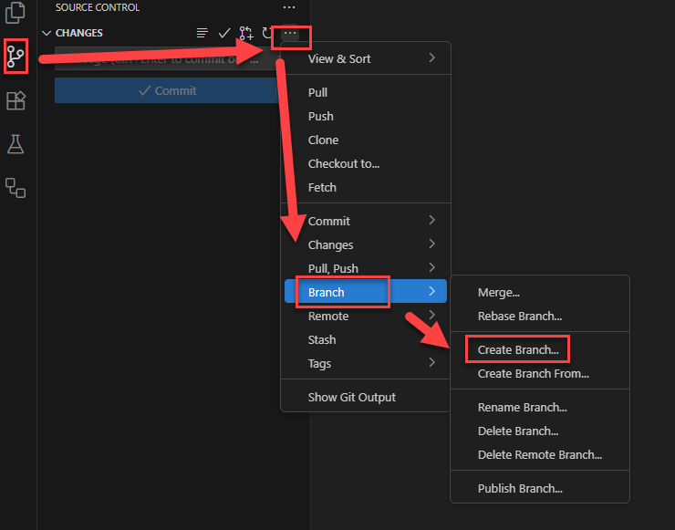
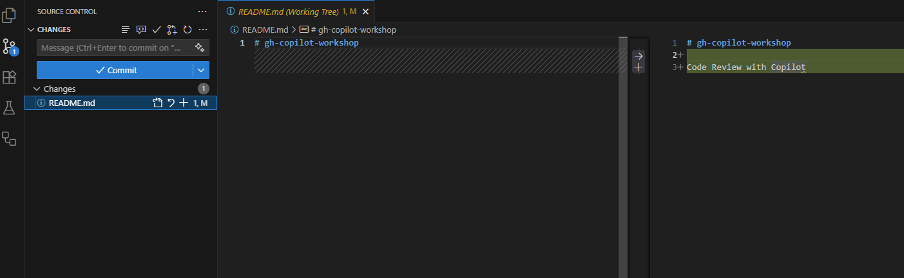
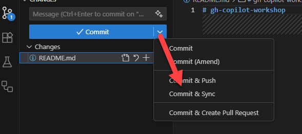
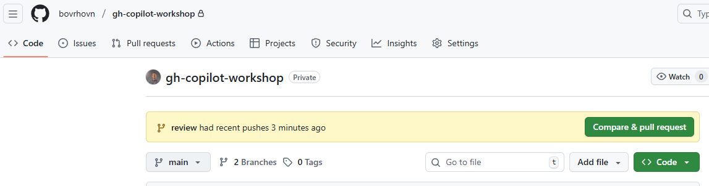
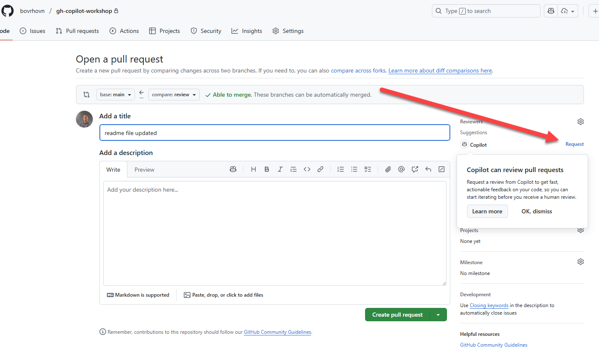
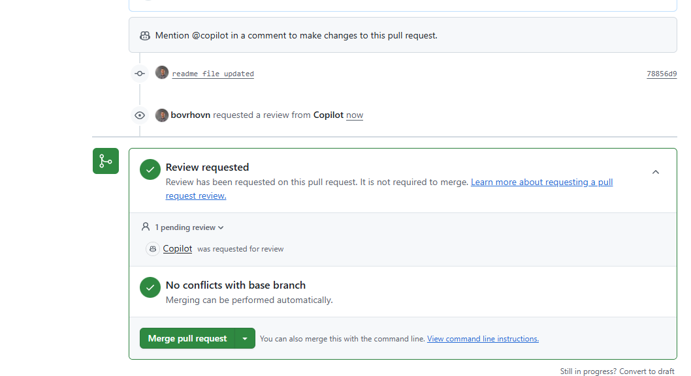
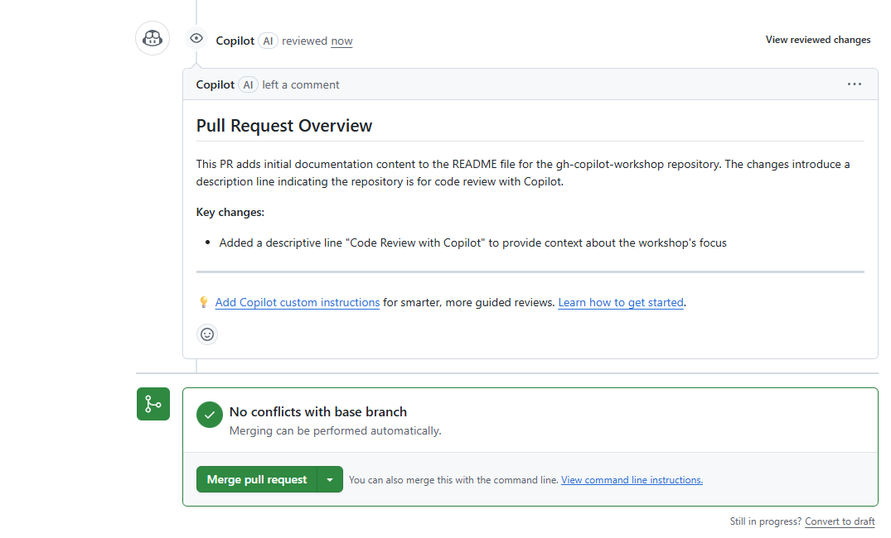

# Review agent

We can leverage Copilot to help us review code changes made by other users / agents. This is particularly useful for ensuring code quality and adherence to best practices.

Create new branch, name it **review**. Do a change to any file in the repository, for example, update the README.md to add a new section called "Code Review with Copilot".

Push the changes to the remote repository.

Put in the name and use dropdown to select Commit and Sync.

If required, confirm changes.

Go to the GitHub repository online where the code changes are located, switch branches to **review**. 

Click on the request button and on button Create pull request.

And copilot is being used to review the code changes.

After a few moments, the review comments are added to the PR by Copilot.

You can now go ahead and merge the PR if you are satisfied with the changes and the review comments.

	<a href="9-debug-copilot.md">⬅️ Previous: Debug GitHub Copilot Chat</a> |
	<a href="0-project-explanation.md">🏠 Home: Start with workshop</a>

4