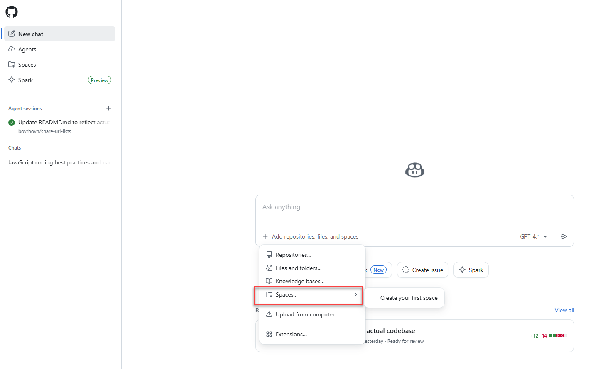
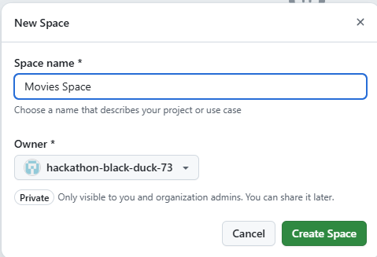
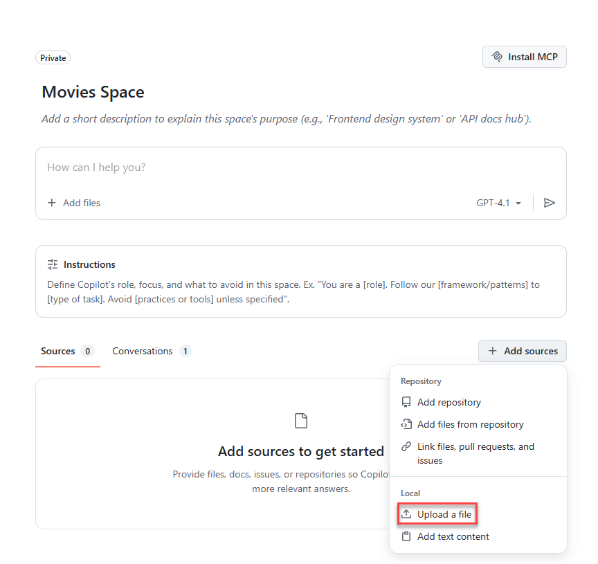
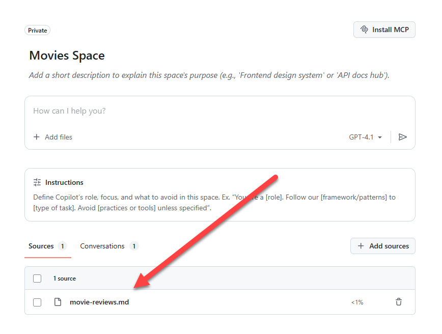
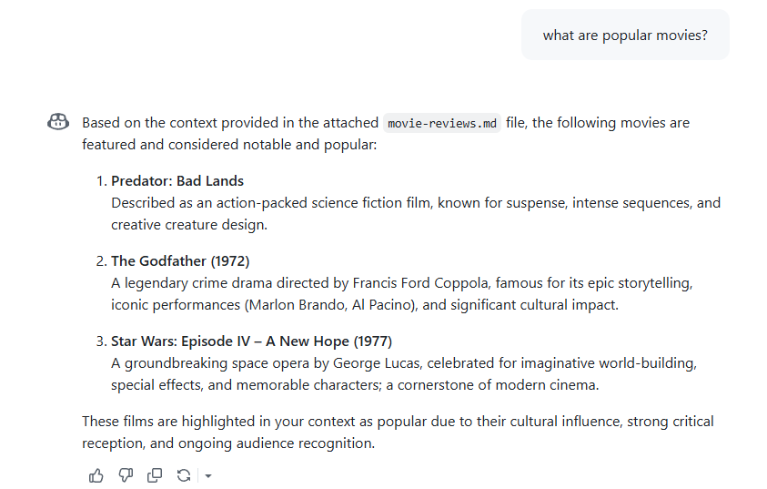
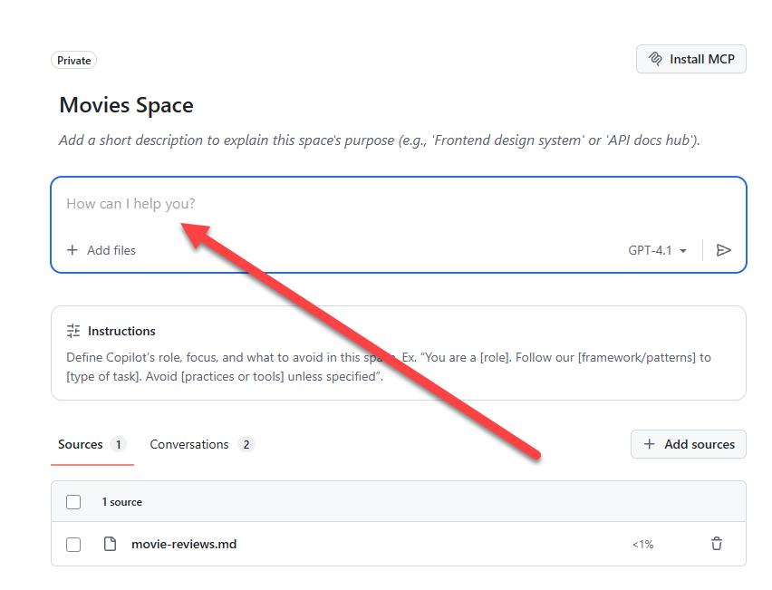
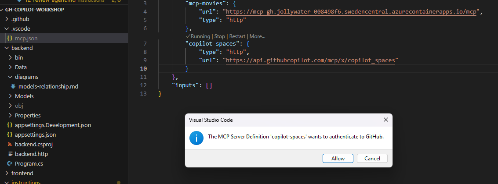
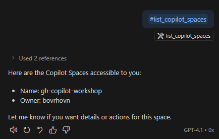

# Copilot Spaces

Copilot Spaces organize task-specific code, documents, and instructions so Copilot can answer questions with the right context.

Open the Copilot Spaces portal
Visit https://github.com/copilot/spaces, choose Spaces in the sidebar, and click Create space. 



Enter a name for your space, such as "Movies review", and click Create space.



Upload relevant files. Select example file in the "starters/files" folder, such as "movie-reviews.md", and upload it to your space by clicking Upload files.



You should see items listed in your space.



Now you can ask Copilot questions about the files in your space. Click Ask Copilot, enter a question such as "What are some popular movies?", and click Submit.



You can use direct UI in your space to interact with Copilot and get answers based on the context of the files you uploaded.



You've created a Copilot Space, added files, and asked Copilot questions using the context of those files. You can continue to add more files and ask more questions as needed.

Let's see how to use Copilot directly from VS Code.

Add the following configuration to mcp.json and start the copilot-spaces MCP service:

```
"copilot-spaces": {
  "type": "http",
  "url": "https://api.githubcopilot.com/mcp/x/copilot_spaces"
}
```
Since we already work with MCP server, adding them to repository level mcp.json is sufficient. Look for .vscode/mcp.json file in the root of the repository and add the above configuration.



When you press start, you'll be required to authenticate with GitHub to allow access to Copilot Spaces.

We can now use Copilot Spaces from VS Code. Open the copilot chat.

```
PROMPT: #list_copilot_spaces
```

You should see a list of your Copilot Spaces. Select the "Movies review" space you created earlier.



You can now ask questions directly from VS Code using the context of your Copilot Space.

<div align="center">
	<a href="9-debug-copilot.md">⬅️ Previous: Debug GitHub Copilot Chat</a> |
	<a href="0-project-explanation.md">🏠 Home: Start with workshop</a>
</div>