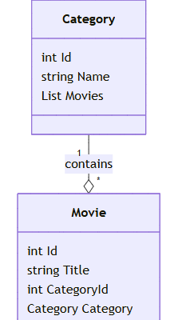
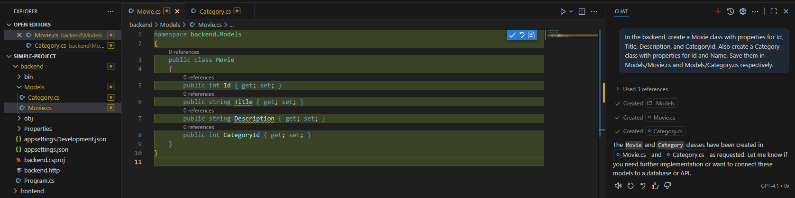
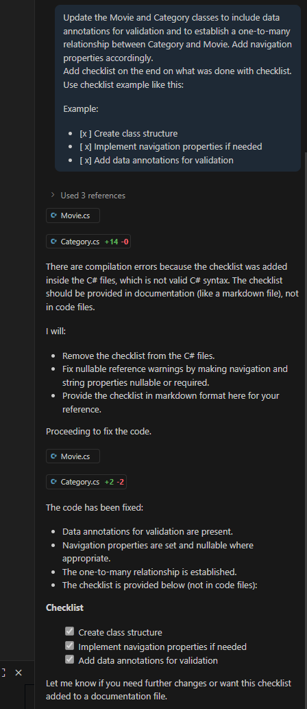
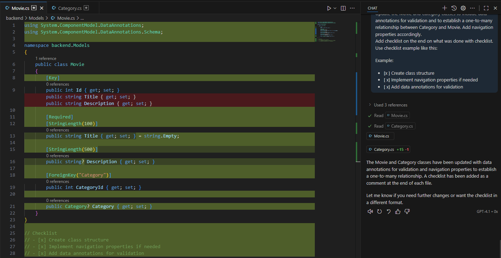
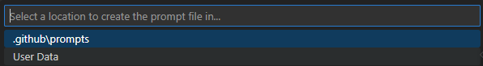
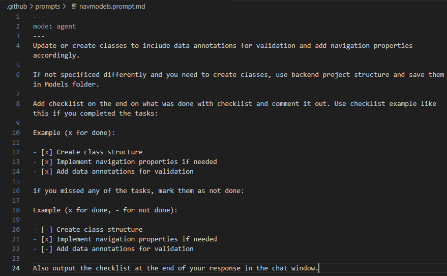
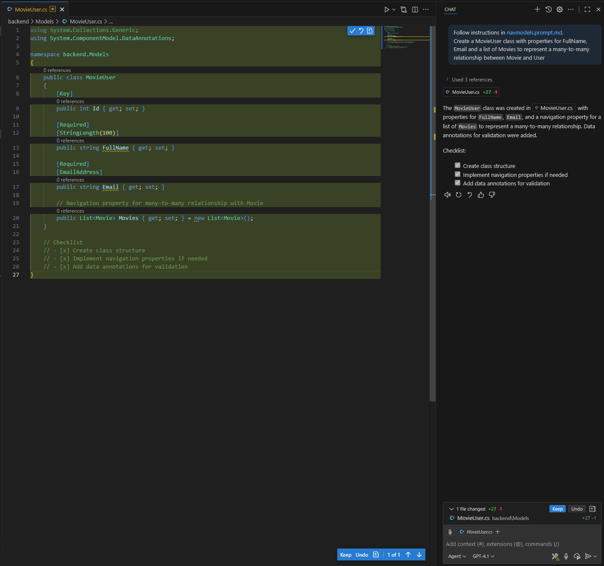
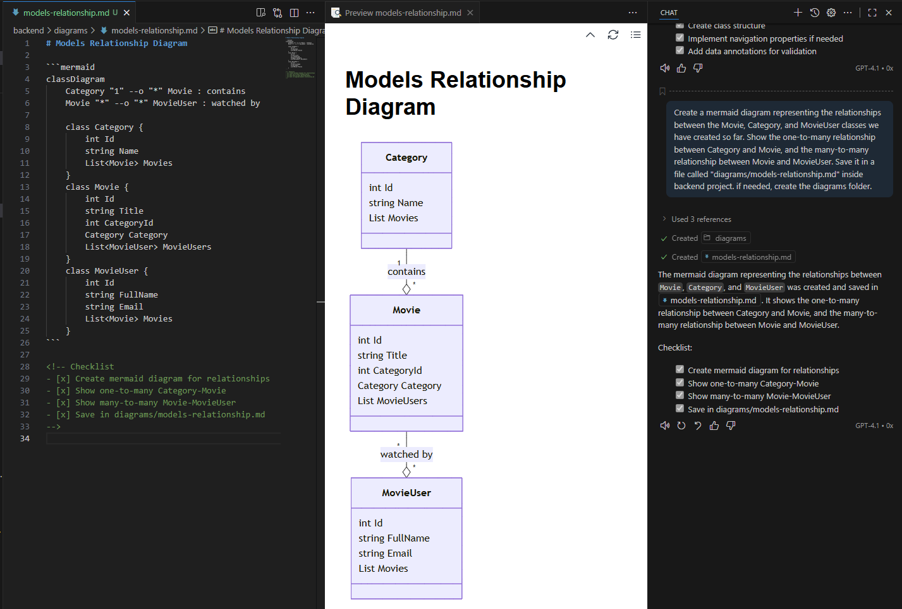
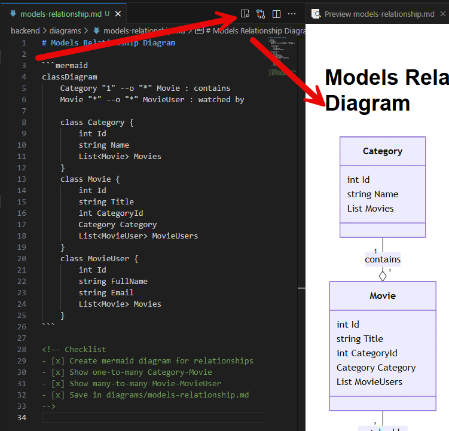

# Add code for backend

Lets add code to the backend to map to the models, which will represent our data structure. We will learn how to use Copilot in agent mode to create classes with data annotations and navigation properties. Finally, we will create a mermaid diagram to represent the relationships between the models with GitHub Copilot help.

Open the backend project in your code editor. We would like to search movies and separate them by category. After whiteboarding, we have decided on the following structure:



For that purpose, we will need Movie and Category class to represent our data.

Open `Copilot chat` and use agent mode (with GPT-4.1 enabled).

Ask Copilot to create a "Movie" class with properties for "Id", "Title", "Description", and "CategoryId" a "Category" class with properties for "Id" and "Name" and let him create a new file "Models/Movie.cs" and "Models/Category.cs" for you.

```
PROMPT: In the backend, create a Movie class with properties for Id, Title, Description, and CategoryId. Also create a Category class with properties for Id and Name. Save them in Models/Movie.cs and Models/Category.cs respectively.

```



Save changes. Copilot generated and created clases, but we have more complex requirements. We plan to use Entity Framework Core for data access, so we need to add data annotations for validation and relationships between Movie and Category. 

If Movie needs to have one Category and Category can have many Movies, we need to add navigation properties as well to easy navigate inside code. Also, we want to ensure that copilot has added navigation properties and data annotations for required fields. If this is simple models, no problems, but if complex implementation, we want to have checklist to be sure if everything is a we planned and those checklist to be available in code and in Copilot chat window. 

Switch to `Edit` mode. What you will see after the edit is invoked is something like this:



```
PROMPT: Update the Movie and Category classes to include data annotations for validation and to establish a one-to-many relationship between Category and Movie. Add navigation properties accordingly.
Add checklist on the end on what was done with checklist. Use checklist example like this:

Example:

- [x] Create class structure
- [x] Implement navigation properties if needed
- [x] Add data annotations for validation

```



This is what we wanted, but we can easily forget this prompt for next iteration. We need to somehow make this available for all classes we add to Models folder. Let's take advante of Copilot custom prompts for classes in Models folder. 

Open `Copilot settings` and add custom prompt for Models folder with the modified prompt as above.Namely, go to chat, select `Settings` icon in top upper corner, then select `Prompts` menu, then `New prompt file`.

 

Pick a name `navmodels` and location (choose `.github/prompts`):



After creation is completed, put in the following content:

```
---
mode: agent
---
Update or create classes to include data annotations for validation and add navigation properties accordingly.

If not specificed differently and you need to create classes, use backend project structure and save them in Models folder.

Add checklist on the end on what was done with checklist and comment it out. Use checklist example like this if you completed the tasks:

Example (x for done):

- [x] Create class structure
- [x] Implement navigation properties if needed
- [x] Add data annotations for validation

if you missed any of the tasks, mark them as not done:

Example (x for done, - for not done):

- [-] Create class structure
- [x] Implement navigation properties if needed
- [-] Add data annotations for validation

Also output the checklist at the end of your response in the chat window.

```

It should look like this (now select `agent` mode):



Save the file. Try to use the prompt by creating a new class in Models folder for a `MovieUser` with properties FullName, Email and movie list. We have many users and each user can have many movies. Let Copilot add data annotations and navigation properties automatically with the newly created prompt.

```
PROMPT: /navmodels Create a MovieUser class with properties for FullName, Email and a list of Movies to represent a many-to-many relationship between Movie and User
```

**NOTE:**
Make sure you have agent mode selected.

You should get something like this:



Confirm the changes and save the file.

Lets create visual representation of the models and their relationships. 

Go to copilot chat and ask it to create an `mermaid diagram` for the models we have created so far: Movie, Category and MovieUser.

```
PROMPT: Create a mermaid diagram representing the relationships between the Movie, Category, and MovieUser classes we have created so far. Show the one-to-many relationship between Category and Movie, and the many-to-many relationship between Movie and MovieUser. Save it in a file called "diagrams/models-relationship.md" inside backend project. if needed, create the diagrams folder.
```

When done, you should see something like this:



Review the generated diagram file and confirm the relationships are correctly represented. 

Go to `diagrams/models-relationship.md` file and choose preview icon to see the rendered diagram.



## Additional exercise

Add new model class Favorites and add properties for Id, Name and a list of Movies. Each user can have many favorite lists and each favorite list can have many movies. Update the mermaid diagram accordingly.

Do it with one prompt.

Check what happens when you select `Edit mode`.

## Next steps

Now that we have the models, we can proceed to implement our data storage and API endpoints for managing movies and categories.

<div align="center">

| [⬅️ Previous: Clean Boilerplate](1-clean-boilerplate.md) | [Next: Add Database Context ➡️](3-add-db-context.md) |
|:-------------------------------------------------------:|:----------------------------------------------------:|

</div>
