# Add Database Context

We have data models for our movies, but we a way to store the data in a database. For simplicity sake, we will leverage Entity Framework Core with an in-memory database provider. This will allow us to focus on the concepts without the overhead of setting up a full database server and to bootstrap the application quickly with tests as well. And then we will replace that implementation with Sqlite.

Open the backend project in your code editor.

Let us use `Agent mode` to add new `DbContext` class to manage our database operations in memory to see what happens. 

```
PROMPT: Based on models defined in backend with the relationships defined in diagrams/models-relationship.md, create a new class named MovieContext that inherits from DbContext. Define DbSet properties for Category, Movie, and MovieUser models. Configure the relationships in the OnModelCreating method to reflect the one-to-many relationship between Category and Movie, and the many-to-many relationship between Movie and MovieUser. Save the file as MovieContext.cs in the Data folder of the backend project. Add necessary using directives for Entity Framework Core and the models and nuget packages.
```

You get something like this:

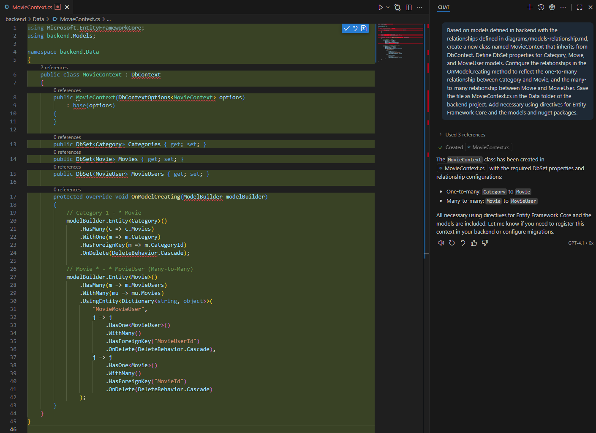

To compare, switch to `Edit` mode to update the backend to use the newly created MovieContext for data operations and check what has changed.

Use the same prompt (`HINT`: just press up in the chat window and last prompt will appear). If offered, click `Undo` and continue if offered.

You get something like this:

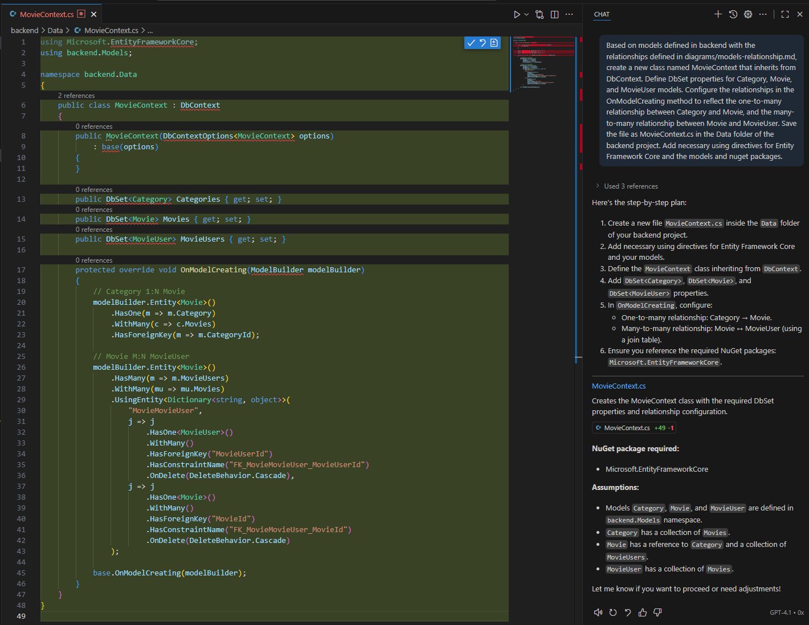

Confirm the changes and let the `Edit` proceed to update the backend code to use the MovieContext for data operations. Review and test the changes made by the Copilot.

Let's switch back to `Agent` mode to help us with compiling and fixing any issues that they might occur. We will need nuget packages and let's leverage copilot to fix any challengest for us. 

Use this prompt to compile the project:

```
PROMPT: compile the backend project
```


Of course, compile operation fails, but agent mode suggest operations to fix the issues. Confirm and let the agent fix the issues.

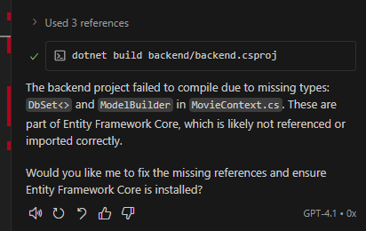

Converse with the agent to fix any remaining issues until the project compiles successfully. Try different prompts if needed.

```
PROMPT: yes, add all the necessary nuget packages.
```

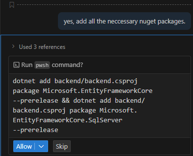

If you have multiple version of .NET installed, it will use `prerelease version` of the package. You can specify the version to use in the prompt, but for now, let us accept the changes and continue.

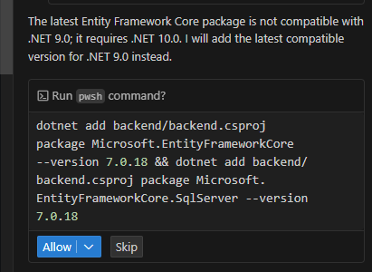

Lets confirm (click `Allow`) and let the agent fix the issues. Review and test the changes made by the agent.

Let us now recompile the project to ensure everything is working fine.

Agent figured out we are missing properties in Movie model for many-to-many relationship with MovieUser and added them for us. This is a good example of how AI can help, especially in bigger projects, but we still need to check the execution and correctness of the code. **Always review the changes made by the agent.**

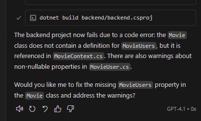

Agent updates classes to fix references to MovieContext and DbContext.

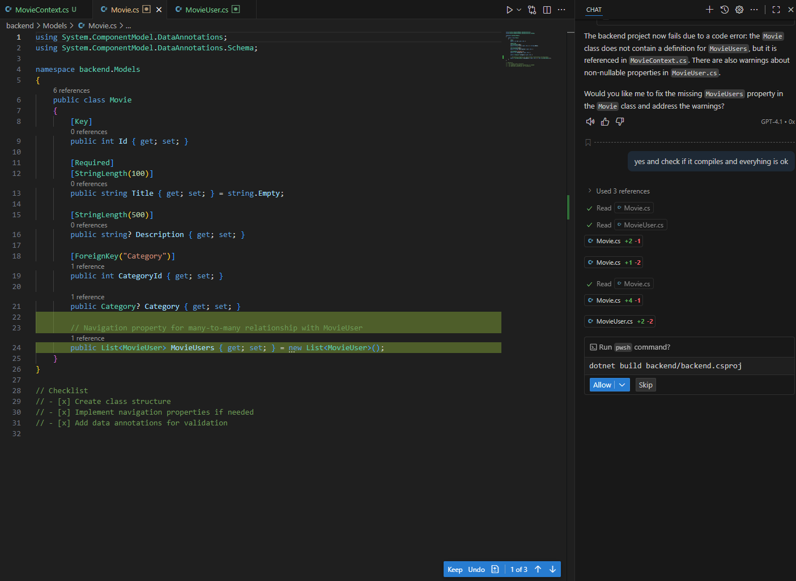

And after last retry, we have a successful compilation.


Let's now expose an endpoint and test the database operations in memory.

```
PROMPT: based on the existing code structure in the backend project, add a minimal api with 2 endpoints - one is seed and one is get movies. The seed endpoint should populate the in-memory database with sample data for categories and movies. The get movies endpoint should retrieve and return all movies along with their associated categories. Use the MovieContext for database operations. Save the changes.
```

It added the following code and endpoints in `Program.cs` - but since we want to make sure we use memory, agent figured out that we need to add that as well:

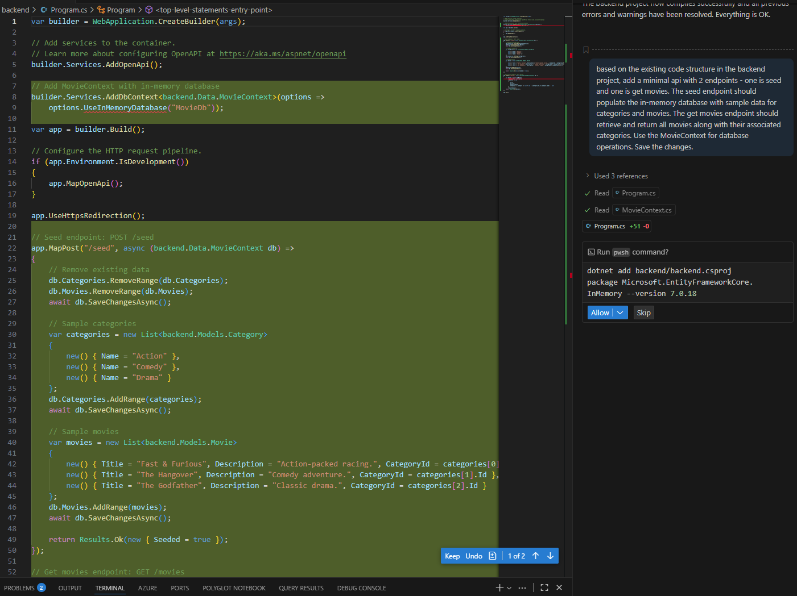

Confirm the changes and let the agent execute adding the nuget packages. 

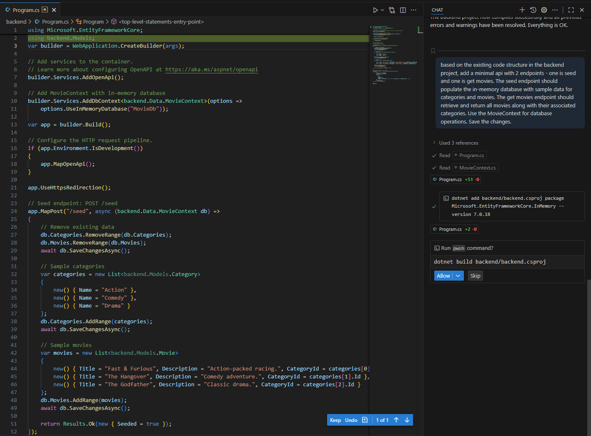

Let agent rebuild the project and fix any issues. Review and test the changes made by the agent.

Now we need to test the endpoint. Let's leverage agent to update backend.http file to add the new endpoints and ways to test them.

```
PROMPT: update the backend.http file to add requests for the newly created seed and get movies endpoints. Include necessary HTTP methods and URLs based on the existing structure in the backend.http file. Save the changes.
```

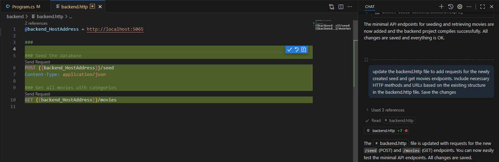

Confirm the changes and let the agent update the `backend.http` file.

Lets try the seed endpoint first to populate the database.

Run the aplication and execute the seed request in backend.http file. `HINT`: use the "Send Request" link above the request in the http file and make sure the backend is running (you can use agent for running the app).

```
PROMPT: run the backend project.
```

When the application is running, execute the seed request in backend.http file. You should see a successful response indicating that the database has been seeded.

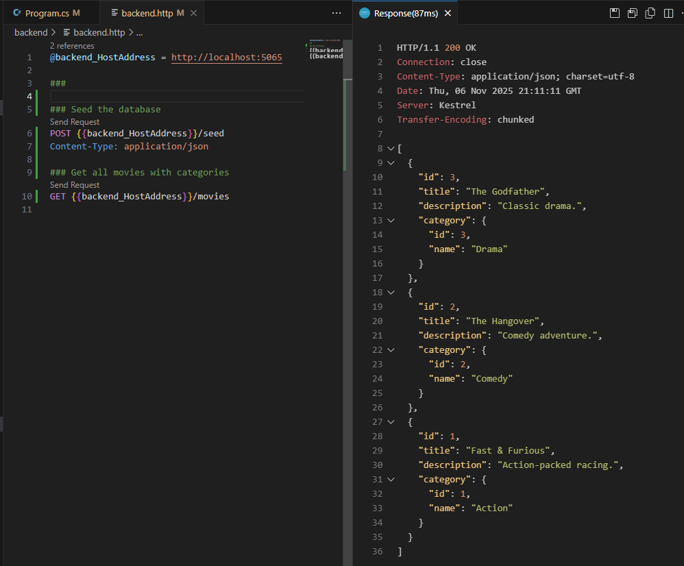

## Additional exercise

We need more random data. Let's leverage agent to replace the implementation of seed endpoint to add more random data using Bogus nuget package.

PROMPT: update the seed endpoint implementation to use Bogus nuget package to generate more random data for categories and movies. Ensure that the generated data maintains the relationships between categories and movies. Save the changes.

Confirm the changes and let the agent update the seed endpoint implementation. Review and test the changes made by the agent.

You should see something like this:

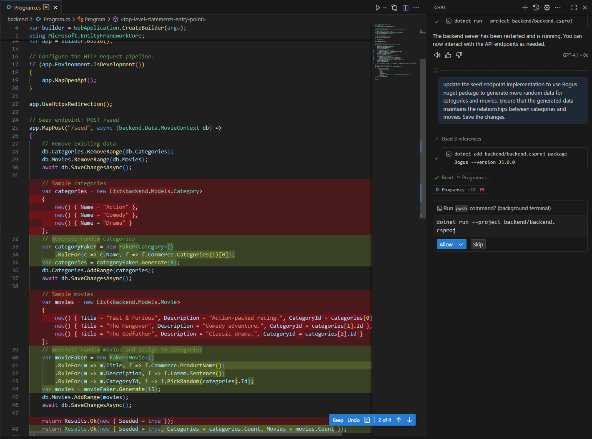

## Next steps

Now that we have the models, we can proceed to implement our data storage and API endpoints for managing movies and categories.

<div align="center">

| [⬅️ Previous: Add code for backend](2-add-code-for-backend.md) | [Next: Adding tests ➡️](4-backend-tests.md) |
|:-------------------------------------------------------:|:----------------------------------------------------:|

</div>
