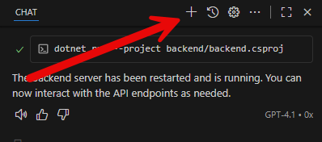
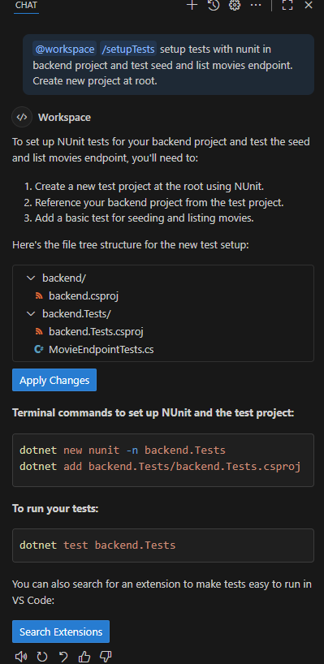
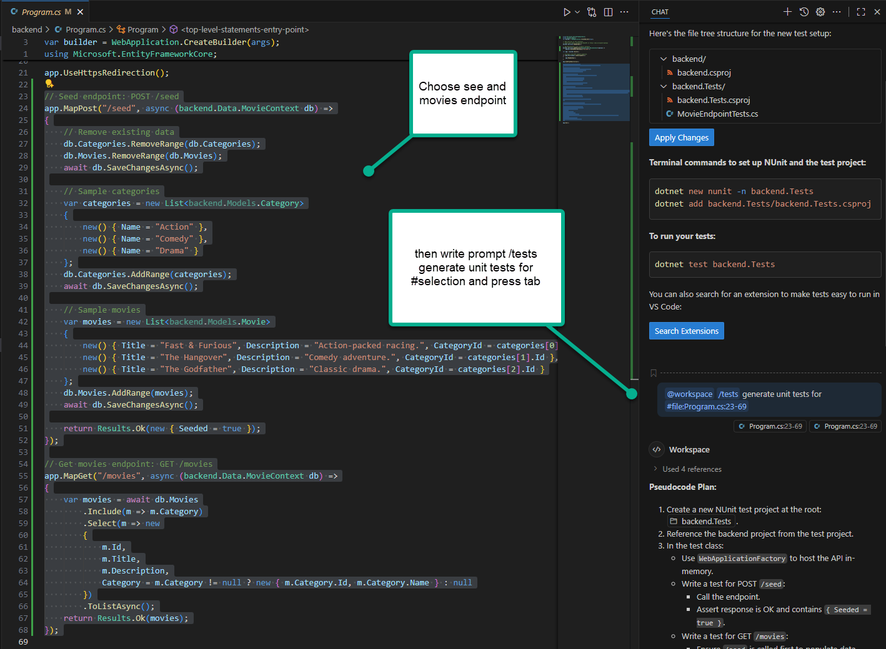
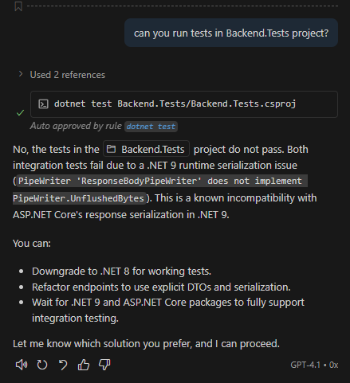
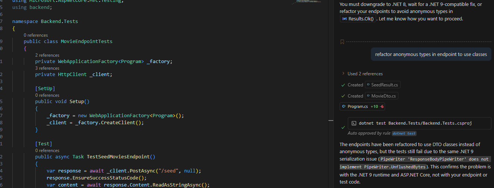
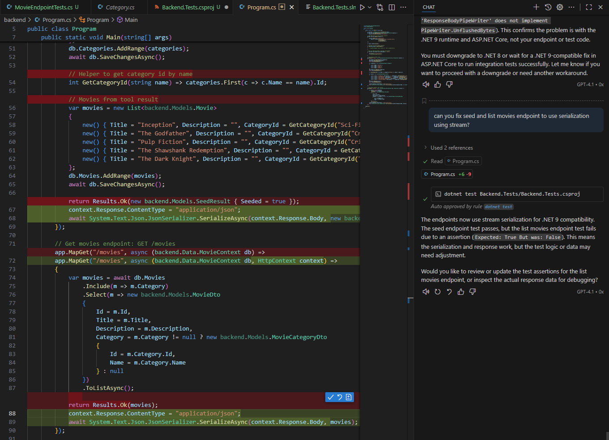
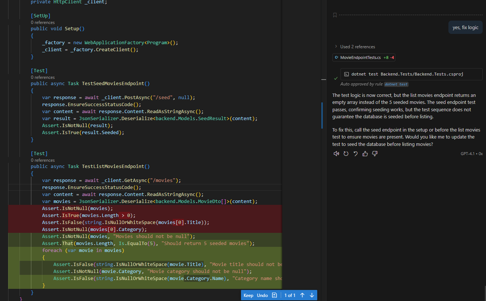
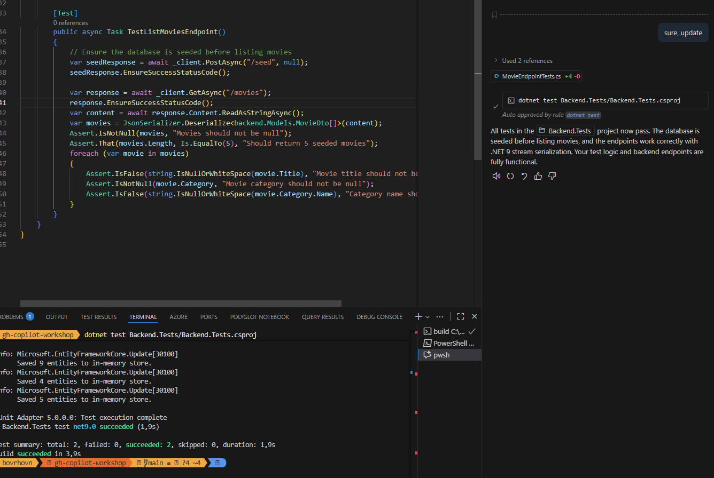

# Add tests for backend API

Our application needs to be tested where it make sense. We will add unit tests for our backend API endpoints to ensure they work as expected. We will use NUnit as our testing framework. You will create a new test project in the solution and add tests for the API endpoints we will create later.

let start new session with our Copilot chat agent.



Let's leverage built in command to setup testing project.

```
PROMPT: /setupTests setup tests with nunit in backend project and test seed and list movies endpoint. Create new project at root.
```



Confirm the changes and let agent create the test project and add reference to backend project.

Open `Program.cs` in backend.Tests project and selects both minimal api endpoints to create tests for them. Then go to prompt and ask agent to create tests for them.

```
PROMPT: /tests generate unit tests for #selection
```



We need to confirm the plan and let agent generate the tests.

```
PROMPT: go ahead and execute based on instructions
```

If not run automatically, run the tests by instructing copilot agent to run the tests in the test project.

```
PROMPT: can you run tests in Backend.Tests project?
``` 

HINT: You can also run the tests manually using Test Explorer in Visual Studio or using the command line with `dotnet test` or by using `smart icons` in the code editor.

After it finished, we got an error in the tests.



We can refactor anonymous types to use DTOs instead. Let's instruct the agent to do that. Notice that agent automatically understand where to put the new classes (Models folder in Backend project).

```
PROMPT: refactor anonymous types in endpoint to use classes
```



After the refactor is done, run the tests again if not run automatically.

We see that test is not updated. Let's instruct the agent to update the test to use the new DTOs.

```
PROMPT: update #file:MovieEndpointTests.cs to use those classes
```

After the update is done, run the tests again if not run automatically.

Error still persist, but there is a hint to leverage streaming option. Let's instruct the agent to update the test to use streaming option.

```
PROMPT: can you fix seed and list movies endpoint to use serialization using stream?
```



After the update is done, run the tests again if not run automatically.

It fixed endpoints to use streams. However, test is still failing. Let's enhance the test to ensure that seeded data is present and let leave to agent to figure it out.

```
PROMPT: yes, fix logic
```



Let the agent fix the test logic. 

```
PROMPT: sure, update
```

After the update is done, run the tests again if not run automatically.

This time tests passed successfully!



## Next steps

Now that we have the models, we can proceed to implement our data storage and API endpoints for managing movies and categories.

<div align="center">

| [⬅️ Previous: Add database context](3-add-db-context.md) | [Next: Configuring frontend ➡️](5-frontend.md) |
|:-------------------------------------------------------:|:----------------------------------------------------:|

</div>