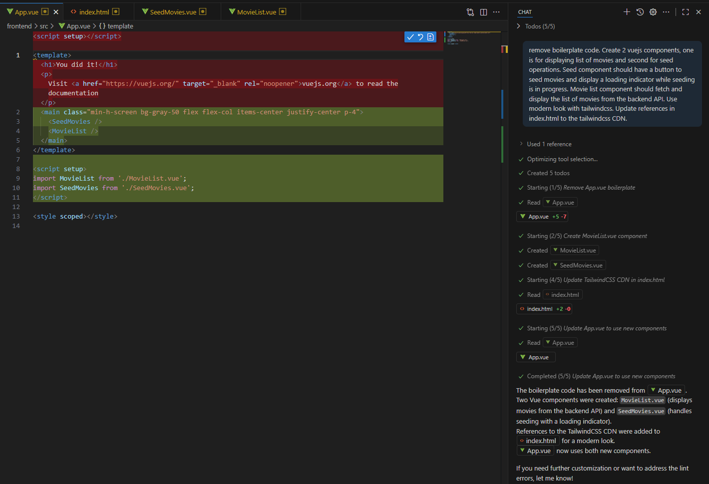
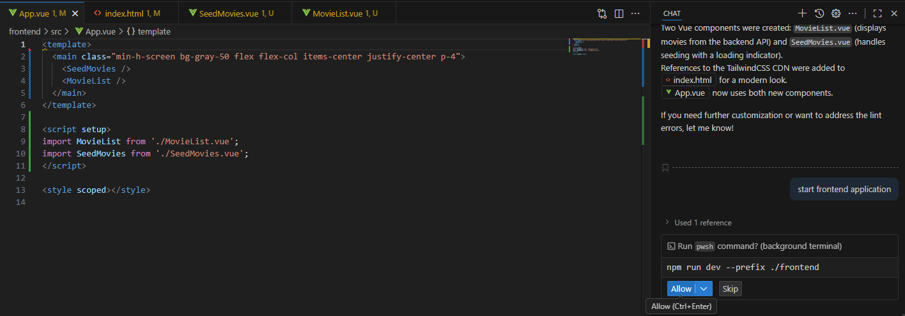
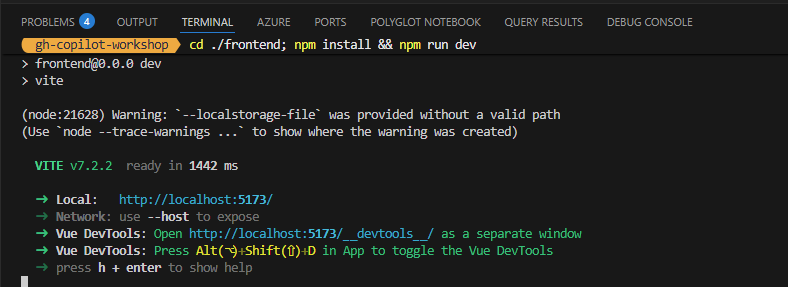
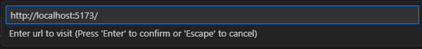
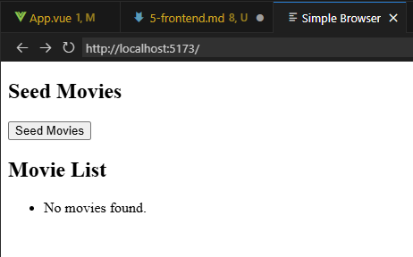
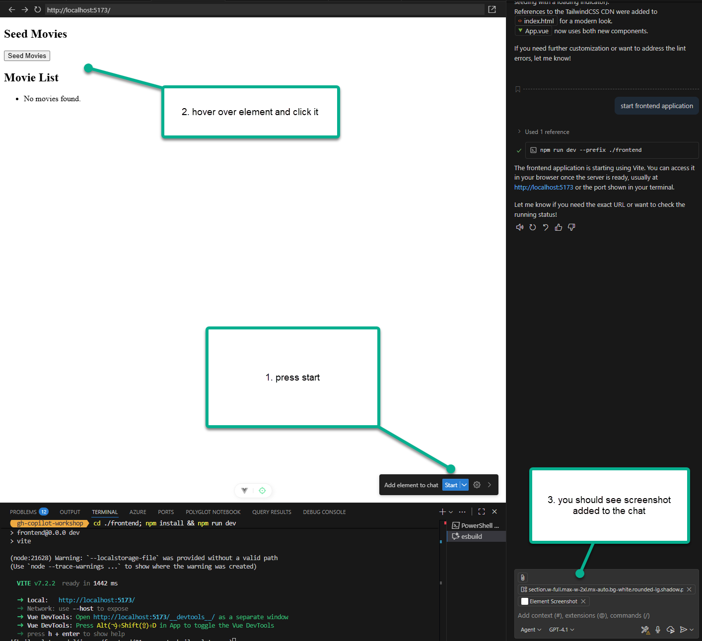
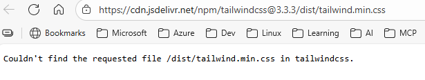
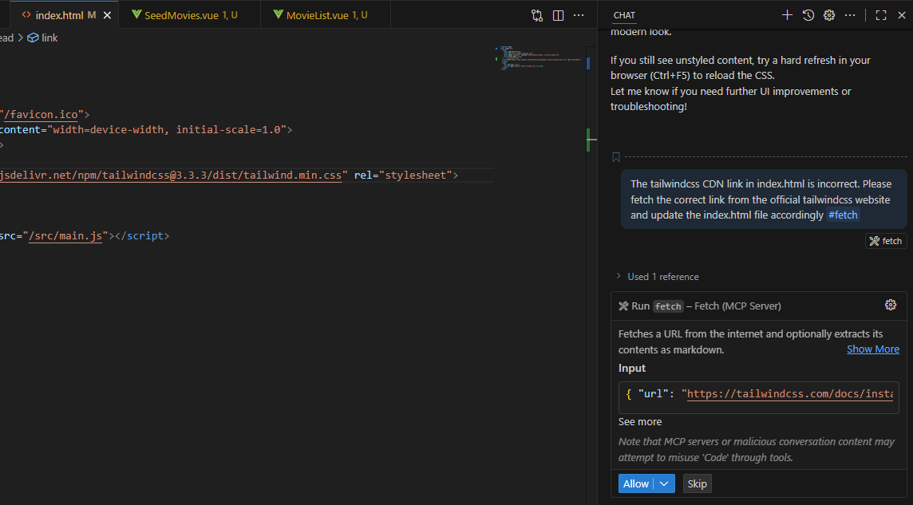
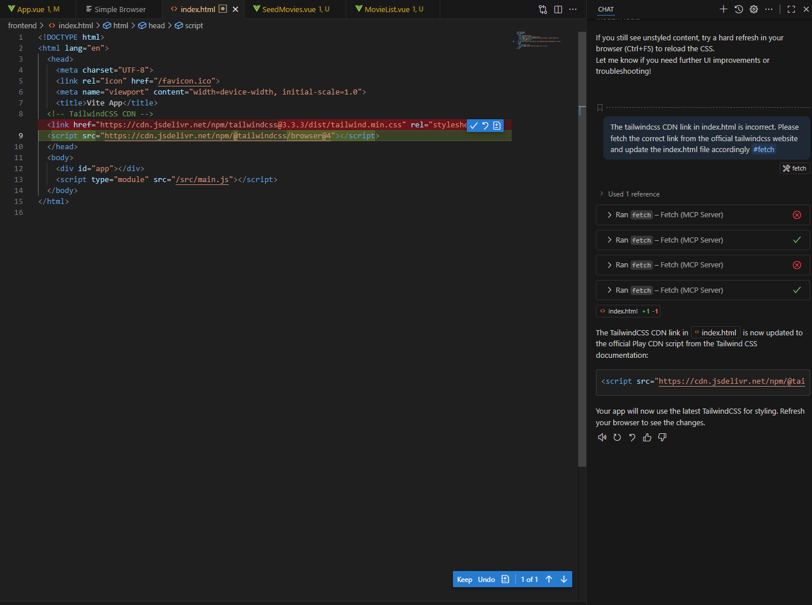
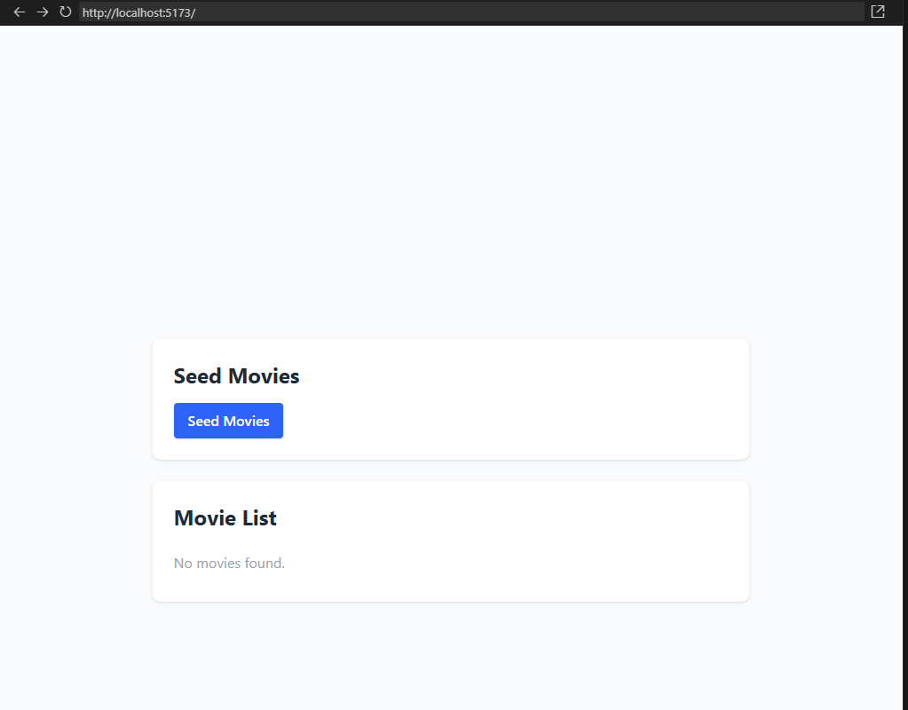

# Frontend work

Now that the backend is set up, let's move on to the frontend.

1. Open the `frontend` folder in your code editor.
2. Inside the `frontend` folder, open the `src` folder.
3. Open the `App.vue` file in your code editor and let copilot do the heavy lifting for you. You can prompt copilot with the following comments to generate the necessary code:

```
PROMPT: remove boilerplate code. Create 2 vuejs components, one is for displaying list of movies and second for seed operations. Seed component should have a button to seed movies and display a loading indicator while seeding is in progress. Movie list component should fetch and display the list of movies from the backend API. Use modern look with tailwindcss. Update references in index.html to the tailwindcss CDN.
```

Save and accept the changes in `App.vue`.



Let agent run the frontend application to verify everything is working as expected. 

```
PROMPT: start frontend application
```



Allow execution and you should see the frontend app running successfully on port 5173(or something else). Copy the URL.



Open `simple browser` (search for it with CTRL+SHIFT+P shortcut) and paste the copied URL to see the frontend app in action.




We should see something like below. It doesn't look very modern. Let's check what is happening.



Let us ask the agent what is happening. Select add element to chat and prompt the agent with below:

```
PROMPT: The frontend app is not using tailwindcss for styling. Please fix the code to use tailwindcss for a modern look.
```



Allow the agent to make changes to the code. Once done, refresh the simple browser window to see the updated UI. Still nothing. You can continue with prompting and pasting in the chat window until the agent updates the `index.html` file to include the tailwindcss CDN link. If you check the CDN, you'll notice this:



Ask agent to check and fix the link to the correct tailwindcss CDN link and tell him to use fetch tool.

```
PROMPT: The tailwindcss CDN link in index.html is incorrect. Please fetch the correct link from the official tailwindcss website and update the index.html file accordingly #fetch
```



After few iterations, the agent should be able to fix the link in `index.html` file. Once done, refresh the simple browser window to see the updated UI.



You should now see a modern looking UI powered by tailwindcss. 



## Next steps

Now that we have the models, we can proceed to implement our data storage and API endpoints for managing movies and categories.

<div align="center">

| [⬅️ Previous: Backend tests](4-backend-tests.md) | [Next: Connecting the dots ➡️](6-connecting-frontend-backend.md) |
|:-------------------------------------------------------:|:----------------------------------------------------:|

</div>