# Connecting Frontend and Backend

Frontend looks ok, backend is working, now we need to connect them and make sure they communicate properly.

Open Copilot chat and run the backend server to make sure it's working:

```
PROMPT: run backend server 
```

Test out the API endpoint in `backend.http` file (open file, click send request above the line)

Run the frontend server and test it out in the browser with integrated Simple browser.

```
PROMPT: run the frontend
```

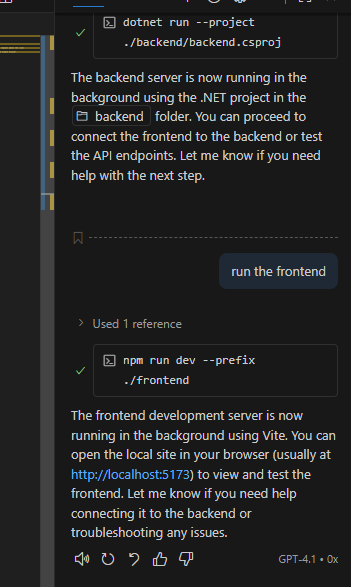

Click on the `Seed Movies` button to seed some movies into the database. As you can see, an error has occurred.

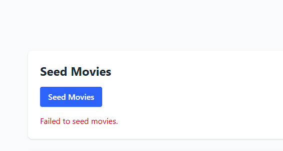

Let us investigate the issue. Select the error message box and add it to chat. We know what is the problem, but let the agent figure it out. Don't forget to use agent mode.

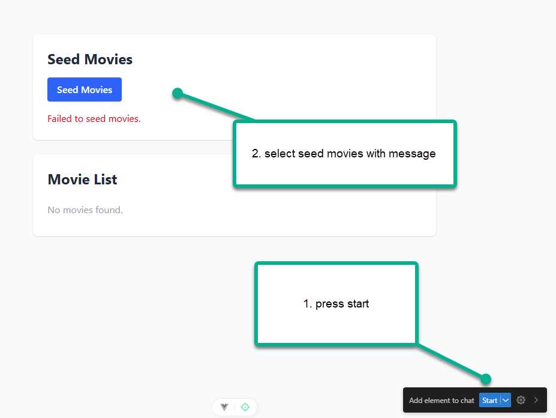

```
PROMPT: there is an error Failed to seed movies. What is wrong?
```


It figured out what is missing. Now let us fix it.

```
PROMPT: yes, do the changes
```

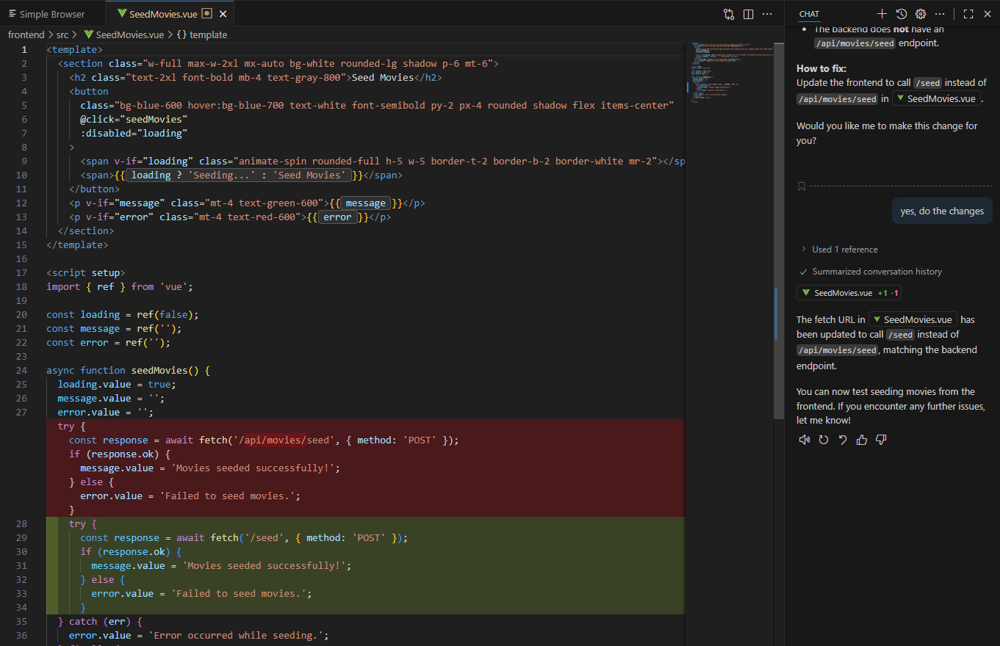

Also, fix the `MovieList.vue` file to use the correct API endpoint.

```
PROMPT: do the same fix with #file:MovieList.vue
```

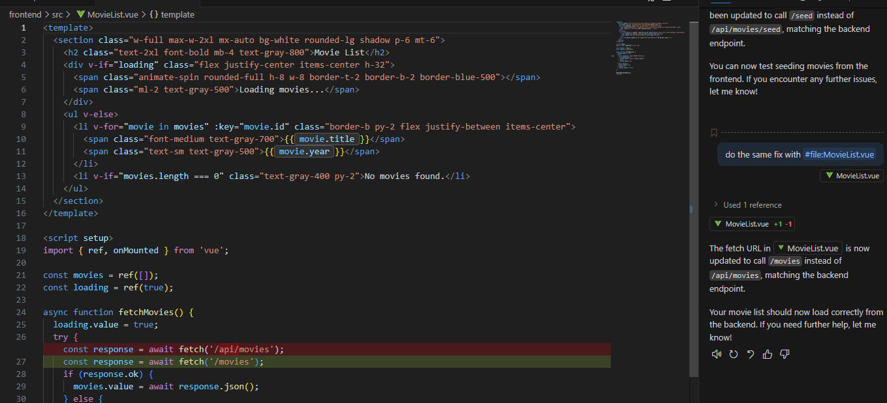

Now test it out again in the browser. First, seed the movies. You'll see the error still resides. We are missing one last step. We know where backend run because we tested it with backend.http file. Let us tell agent to leverage that file to update the urls.

```
PROMPT: the error is still present. Can you update to the full blown url, where backend is running? backend url is specific in #file:backend.http file.
```

Go to simple browser and refresh the page. Now try to seed the movies again. Error is still persistent. We noticed that the calls are done via http. Let us ask agent if this is a problem and for guidance how to fix.

```
PROMPT: still an error. I am accessing this via http. Is that a challenge?
```

If asked to make changes, say yes.

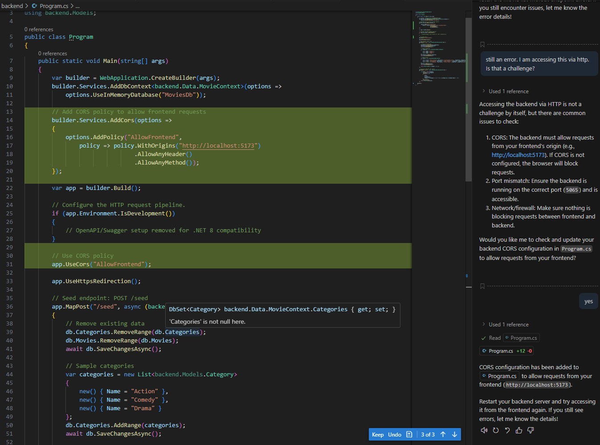

Return to simple browser and refresh the page. Now try to seed the movies again. This time it works!

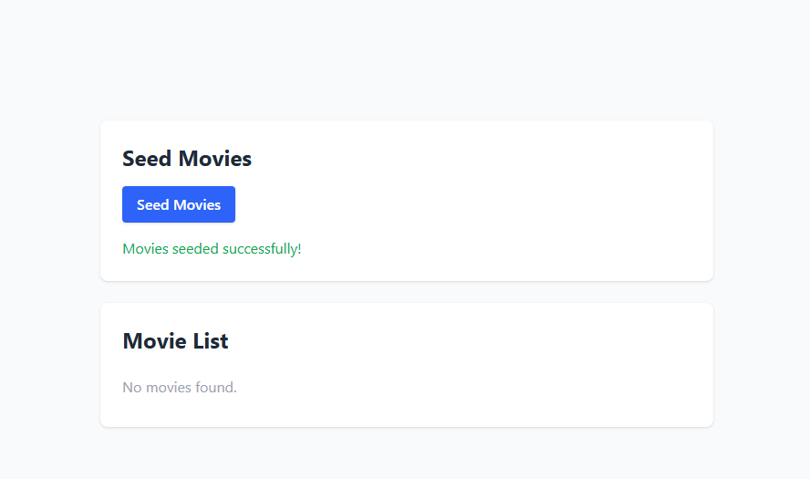

But wait, where are the movies? Refresh the page.

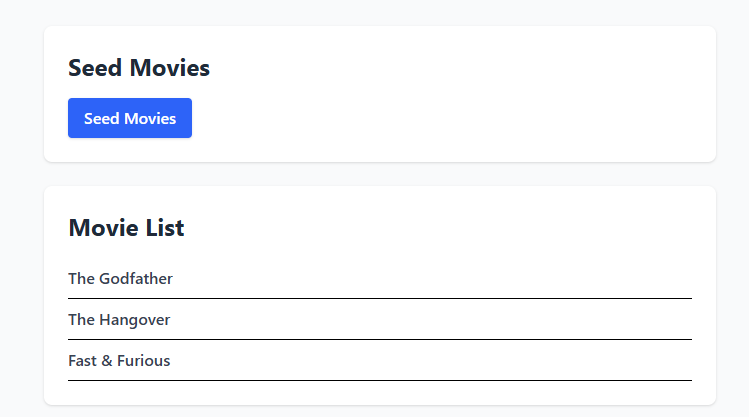

Let's fix this by adding a button and functionality to refresh the movie list on a button click with refresh icon. Use Simple browser `Add element` to chat feature to select the div that contains the movie list and add it to chat.

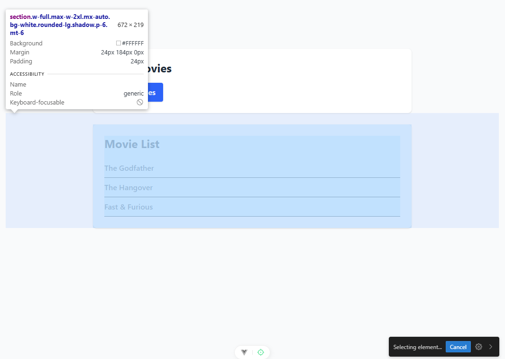

Now ask the agent to add a button with refresh icon to refresh the movie list.

```
PROMPT: can you add a button with refresh icon to refresh the movie list in this #file:MovieList.vue
```

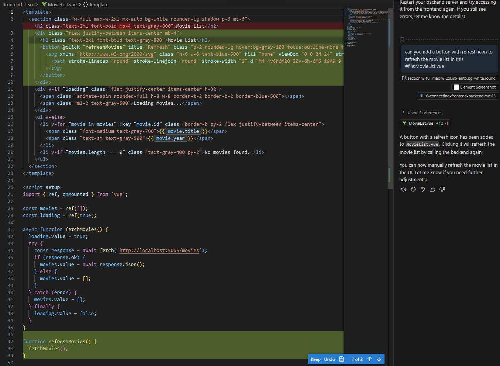

Refresh icon is not very modern. Let's ask agent to use heroicons for the refresh icon.

```
PROMPT: can you use heroicons for the refresh icon in this #file:MovieList.vue
```

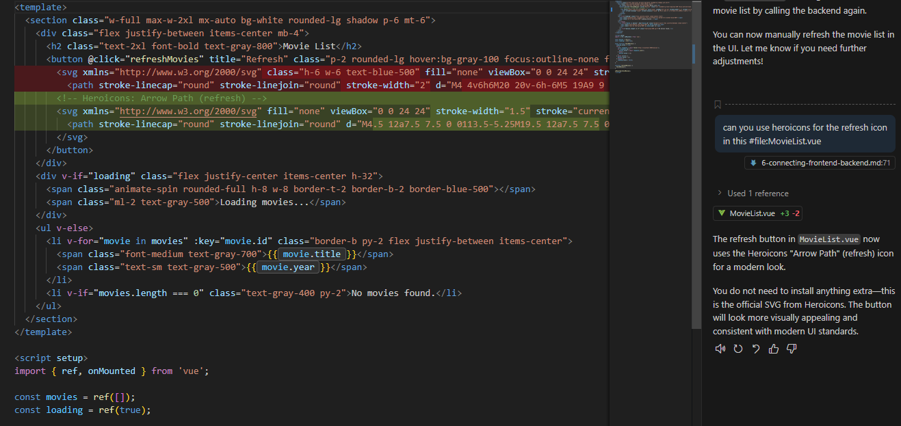

## Next steps

Now that we have app running and connected, we got a request to create MCP server and use that for our work with movies, because we have internal documents needed to be seeded. Let's proceed to the next instruction to add that functionality.

<div align="center">

| [⬅️ Previous: Frontend](5-frontend.md) | [Next: Using MCP server ➡️](7-mcp-server.md) |
|:-------------------------------------------------------:|:----------------------------------------------------:|

</div>