# Adding our own MCP server and using it with GitHub Copilot

We have received internal MCP server with url and source code. They specified that we need to leverage our MCP server for handling our backend operations.

Try to install some MCP servers by adding them through Extensions tab - for example `Azure MCP server`. Search for "MCP Server" and install it.

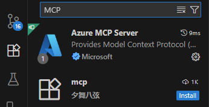

Lets test out received mcp server (check folder [starter/mcp](../starters/mcp/)). Open Terminal and navigate to this folder (you can open terminal in VS Code via Ctrl+` shortcut): 

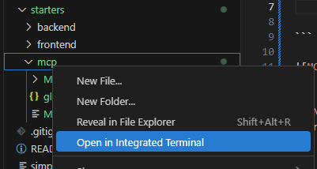

Use PWD to get the current directory to understand where you are. Navigate to **MoviesMCP** folder. Then run the following command to start MCP server:

```
dotnet run --launch-profile http
```

If not yet installed, install MCP inspector tool to review MCP server contents. Information, how to do that and use it,[here](https://github.com/modelcontextprotocol/inspector).

Run the MCP inspector to see what it contains. MCP server is exposed on /mcp endpoint. You should see something like this:

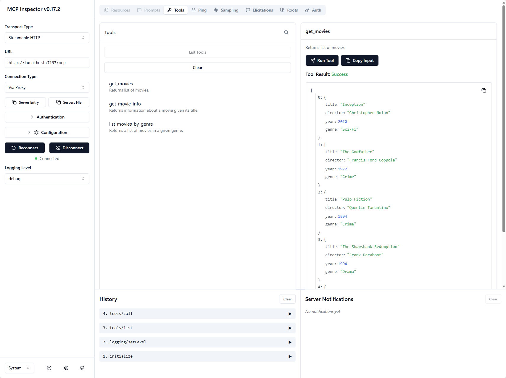

Now that we have MCP server running (leave it running), let us connect our frontend and backend to use MCP server for our operations. 

 We need to register the mcp server so that VS Code can use it. Open Command Palette (Ctrl+Shift+P) and search for "MCP: Add MCP Server". Select it.

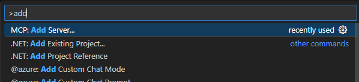

Choose http option.


Put in the name and continue.

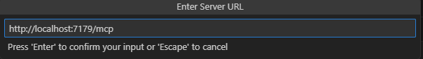

Select local availability (Workspace).

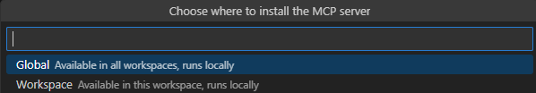

You will be prompted to enter the MCP server URL. Enter `http://localhost:7179/mcp` and hit Enter.

**NOTE:** If your MCP server is running on a different port, please adjust the URL accordingly. 

If everything is fine, you should see a success message. If not and you see an error, please make sure that your MCP server is running in terminal and accessible at the specified URL. If that is ok and error persists (there is a known issue with self-signed certificates with VS Code), then use the hosted version of the MCP server by entering `https://mcp-gh.jollywater-008498f6.swedencentral.azurecontainerapps.io/mcp` as the URL instead.

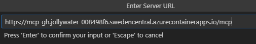

After connecting you should see the MCP server listed in the MCP Servers view. If you go directly to the **.vscode/mcp-servers.json** file, you should see the MCP server details there as well.

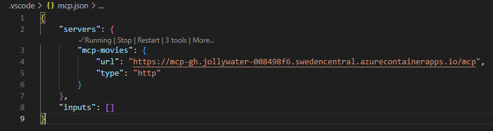

Now that we have our MCP server registered and connected, let's talk with MCP server and use the results to populate our backend.

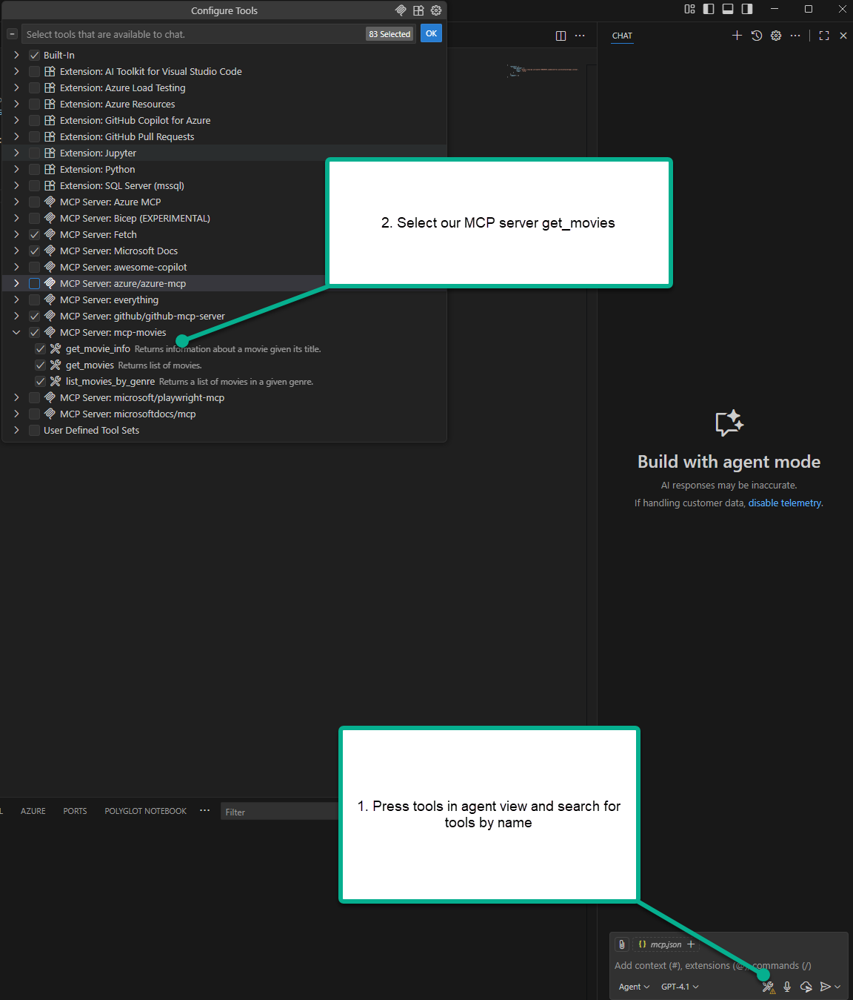

Let's see what movies we do have available in our MCP server.

```
PROMPT: #get_movies
```

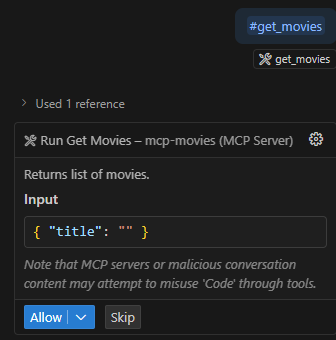

What we get back is a list of movies.

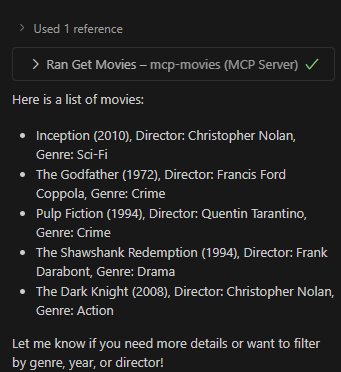

Now let's use this data to populate our backend database our seed method.

```
PROMPT: #get_movies and use the results to populate the list in the seed minimal api in #file:Program.cs
```

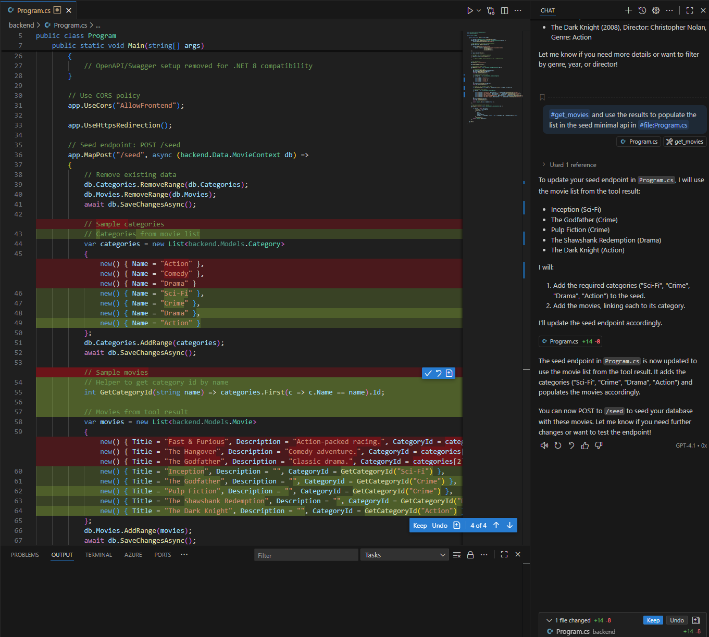

You should see that the seed method is now populated with the movies we got from MCP server. 

**NOTE:**
It didn't add additional details like description or director since those were not part of the MCP server response. You can enhance it further if needed. Also, it didn't create duplicated entries. Agent was smart enough to only add unique entries.

Now let's run the backend and see if it works. Open Terminal in the **backend** folder (or navigate to backend folder) and run:

```bash
dotnet run
```

Open the frontend and try to fetch the movies. You should see the movies populated from the MCP server.

**NOTE:** If you just want to test the backend, you can use backend.http file in the backend folder to test the API directly.

## Next steps

We have now built MCP server and used it to populate our backend data. Next, let's proceed with customizing instructions for copilot.

<div align="center">

| [⬅️ Previous: Connecting frontend and backend](6-connecting-frontend-backend.md) | [Next: Adding instructions with awesome copilot ➡️](8-customizations.md) |
|:-------------------------------------------------------:|:----------------------------------------------------:|

</div>