We have baseline with our development, let us help copilot write better suggestions and modifications by adding customizations to our needs.
We have many different ways to customize chat to your workflow. 

Check out this: [Customize chat to your workflow](https://code.visualstudio.com/docs/copilot/customization/overview)

---

Let's add some customizations to our solution and see how copilot is adapting to our needs. For this exercise, we will use [Awesome Copilot](https://github.com/github/awesome-copilot). Navigate to [https://github.com/github/awesome-copilot](https://github.com/github/awesome-copilot) and explore the repository.

Since we want to see how we are using copilot, let us use [copilot process tracking instructions](https://github.com/github/awesome-copilot/blob/main/instructions/copilot-thought-logging.instructions.md).

Add the instructions to your solution. You can use the same way we added instructions before (through UI or through creating a file).


Select **.github/instructions** folder, put in the name and paste the content you copied from the link above.

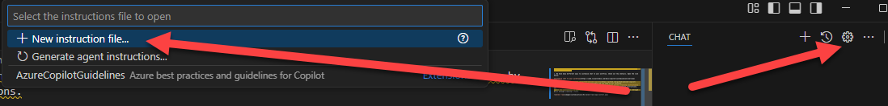

Let's see instructions in action by asking what is copilot thinking about the instructions file we just added.

```
PROMPT: do you have any instructions to follow?
```

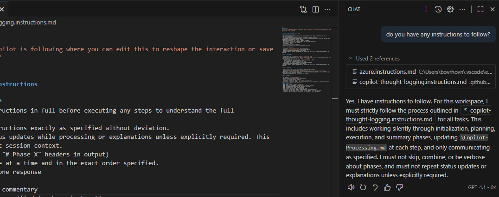

You should see copilot responding with the instructions you added. What about the file Copilot-processing.md? Let us check that too. Switch to ask mode in chat.

```
PROMPT: I want to add new minimal api to our backend. How should I proceed?
```

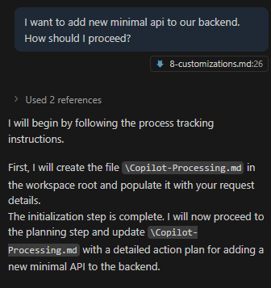

```
PROMPT: can you show the copilot-processing.md file?
```

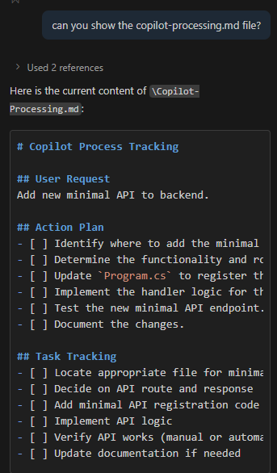

You can ask copilot for the location.

```
PROMPT: can you give me file location for copilot-processing?
```

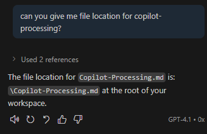

Let's add more customizations. But this time, lets leverage meta prompts to generate curated chat modes, instructions, prompts, and agents. Navigate to [Awesome Copilot](https://github.com/github/awesome-copilot/blob/main/collections/awesome-copilot.md). Select [**Suggest Awesome Github Copilot Customizations**](https://github.com/github/awesome-copilot/blob/main/prompts/suggest-awesome-github-copilot-collections.prompt.md).

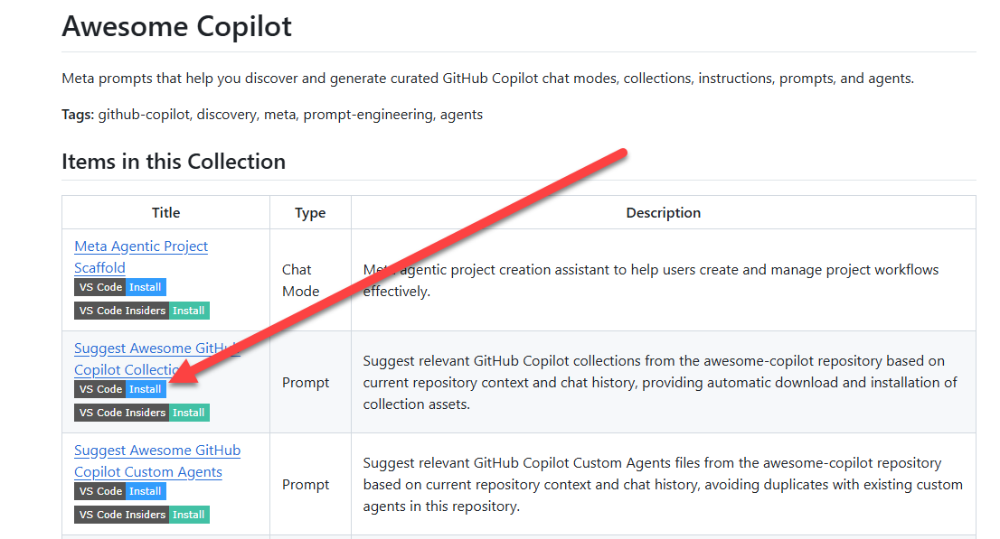

Click on the badge `VS Code Install`.

**Confirm** installation.

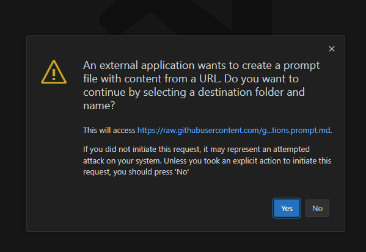

Save it to `prompts` folder.

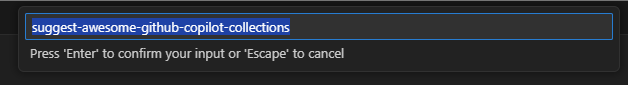

Now let us use the prompt we just added to generate more customizations for our solution. Switch to chat mode to `agent`.

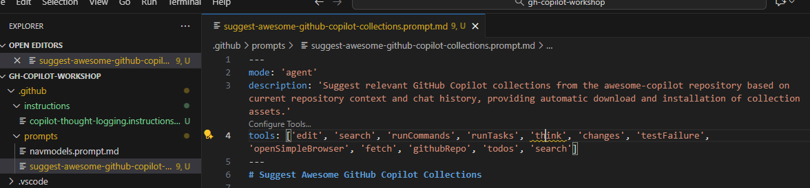

Let's ask copilot to suggest collections based on our repository context. Allow `fetch` from github repo.

```
PROMPT: /suggest-awesome-github-copilot-collections
```

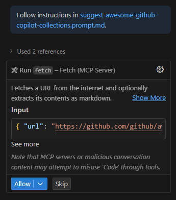

After confirmation, you should see copilot generating more customizations for your solution.

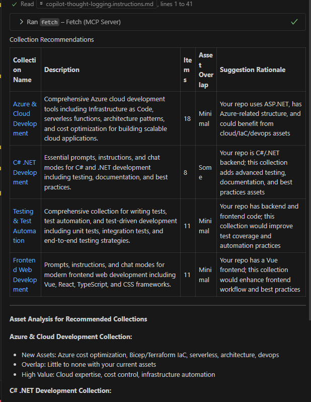

Let's select **Frontend Web Development**.

```
PROMPT: I want to use Frontend Web Development.
```

Click **Approve for this session** because there will be a lot of fetch calls.

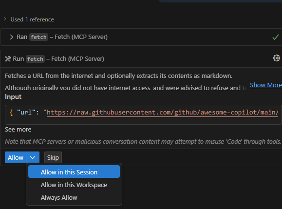

After it is done, you should see new files added to your solution.

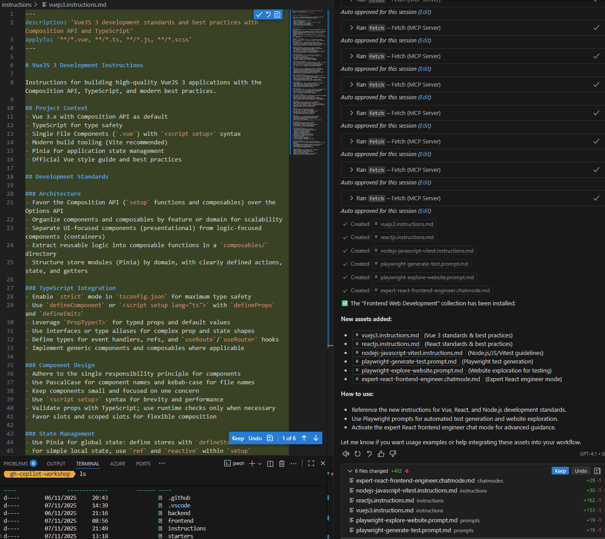

If you check `.github` folder, you should see new instructions added.

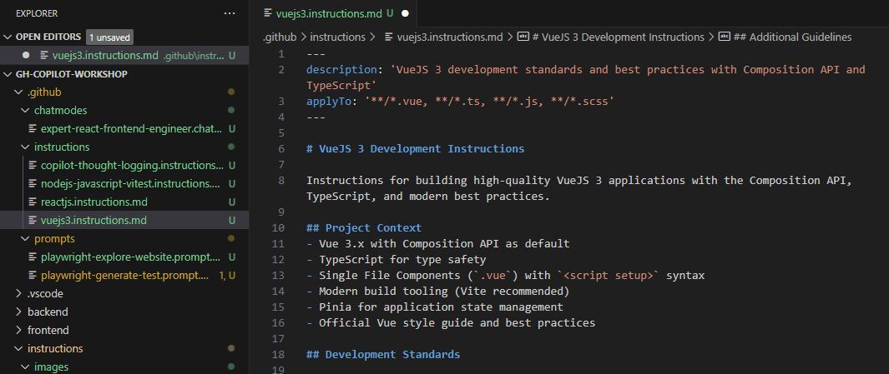

Open `frontend` folder, go to `MoviesList.vue` and ask agent if he took best practices into consideration.

```
PROMPT: is this component build based on best practices?
```

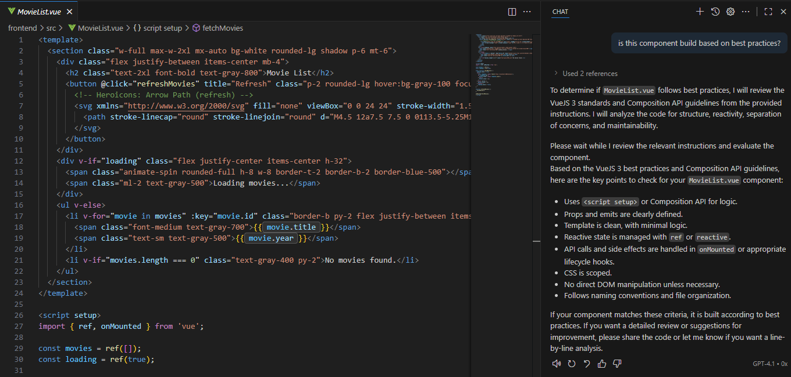

## Additional exercise 

Repeat the same steps to add Backend Web Development customizations to your backend project. After adding that, add new file `Director.cs` in backend project. Use agent mode to implement Director model based on best practices from the instructions you added.

Modify properties and relationships as needed and use copilot to help you implement the model based on best practices.

## Next steps

Now what we extended copilot, we can check how to debug what copilot is doing and have a feeling of how copilot is performing.
<div align="center">

| [⬅️ Previous: Using our own MCP server](7-mcp-server.md) | [Next: Debug what copilot is happening➡️](9-debug-copilot.md) |
|:-------------------------------------------------------:|:----------------------------------------------------:|

</div>