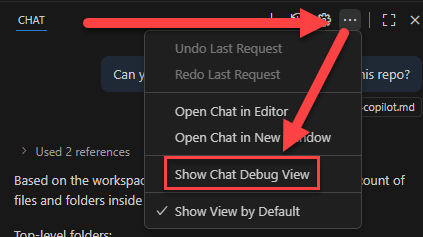
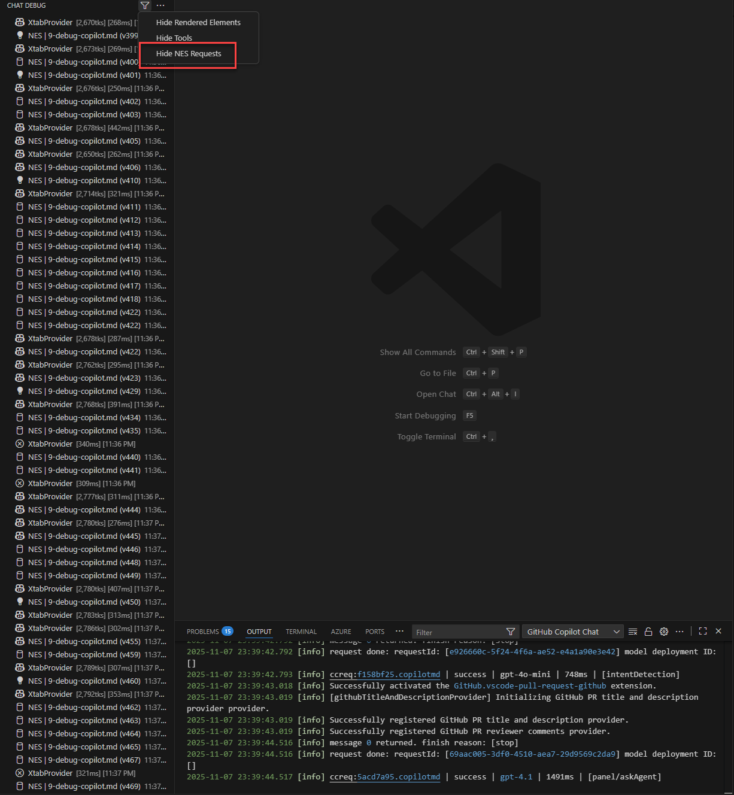
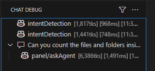
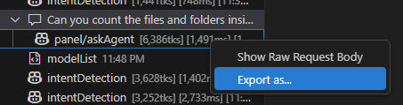
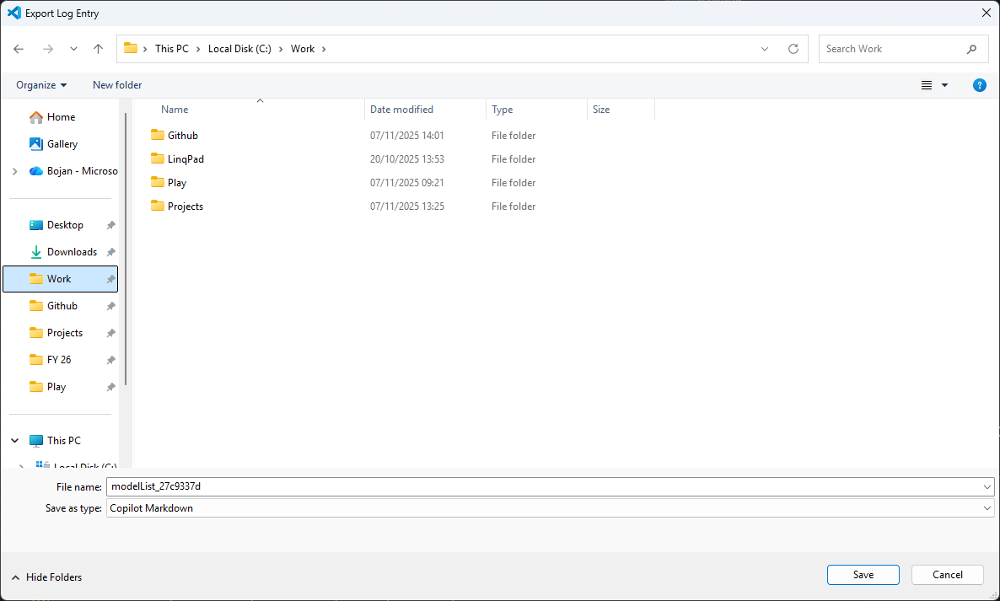
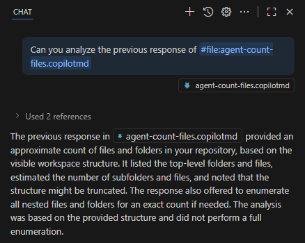
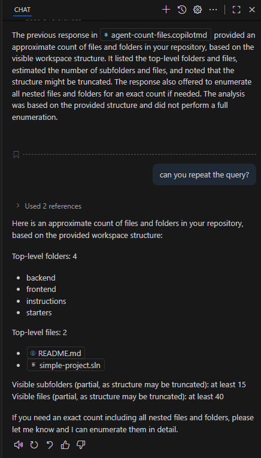

# Debugging GitHub Copilot chats

When working with GitHub Copilot, you might occasionally encounter issues or unexpected behavior. 

Here are some steps to help you debug and resolve common problems - we will use the output and logs options and leverage agent mode to assist in troubleshooting:

- **Check Internet Connection**: Ensure that you have a stable internet connection, as GitHub Copilot relies on cloud services to function.
- **Update VS Code and Extensions**: Make sure you are using the latest version of Visual Studio Code and the GitHub Copilot extension. Updates often include bug fixes and improvements.
- **Review Extension Settings**: Go to the settings of the GitHub Copilot extension and verify that everything is configured correctly. You can access settings by clicking on the gear icon next to the extension in the Extensions view.
- **Check for Conflicting Extensions**: Sometimes, other extensions may conflict with GitHub Copilot. Try disabling other extensions one by one to see if the issue persists.
- **Examine Output and Logs**: Open the Output panel in VS Code (View > Output) and select "GitHub Copilot" from the dropdown menu. Review the logs for any error messages or warnings that could provide clues about the issue.
- **Clear Cache**: Sometimes, clearing the cache can resolve issues. You can do this by uninstalling and reinstalling the GitHub Copilot extension.
- **Check GitHub Status**: Visit the [GitHub Status page](https://www.githubstatus.com/) to see if there are any ongoing outages or issues with GitHub services that might be affecting Copilot.
- **Consult Documentation**: Refer to the [GitHub Copilot documentation](https://docs.github.com/en/copilot) for troubleshooting tips and common issues.
- **Seek Help from the Community**: If you're still having trouble, consider reaching out to the GitHub Copilot community forums or support channels for assistance.

---

Open GitHub copilot chat and enter:

```
PROMPT: Can you count the files and folders inside this repo?
```

Let's check what copilot has done. Go to `Show chat debug view` in Chat windows by pressing ...



Filter NES requests.



You can see the request and response from copilot. Open and explore to see the details.



Let's use agent mode to help us debug further. Let's export the copilotchatmode.



Save the file as **agent-count-files.copilotmd**. 



Add that file to the working folder (copy / paste to root of the repo or drag and drop from explorer).


Open the file in VS Code. You will see the copilot chat history.

Let's navigate to chat window and select the agent mode. Enter prompt.

```
PROMPT: Can you analyze the previous response of #file:agent-count-files.copilotmd
```

You will see copilot analyzing the previous response and providing more insights.



You can continue to debug further by asking more questions or clarifications. And you can also ask for repeating the chatmode.



You can go and send the file to your colleagues for further analysis or debugging and he can analyze the copilot responses further or try to repeat the same.

## Next steps

Now what we extended copilot, we can check how to debug what copilot is doing and have a feeling of how copilot is performing. You can continue with the next instruction file or check additional workshops.

<div align="center">

| [⬅️ Previous: Using our own MCP server](8-customizations.md) | [Codespaces](13-spaces.md) | [Custom agents](11-custom-agent.md) | [Review agent](12-review-agent.md) | [Additional workshops ➡️](10-additional-workshops.md) 

</div>
